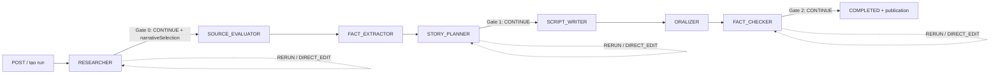

# Script Workflow API

Moderator tạo kịch bản podcast lịch sử 3 tập bằng AI. Hệ thống chạy 7 bước tuần tự, dừng chờ người duyệt ở 3 cổng (Gate). Phạm vi chỉ gồm văn bản kịch bản. Âm thanh nằm ngoài hệ thống: Moderator copy `finalScript` sang ElevenLabs.

- Nguồn schema: `packages/shared/src/schemas/script-workflow/*` (Zod, export từ `@repo/shared`).
- Mã nguồn: `apps/api/src/modules/script-workflow/`.
- OpenAPI/Scalar: tag **Script Workflow** trong `apps/api/src/routes/docs.ts`.

## 1. Quy ước chung

### 1.1 Base và xác thực

| Mục          | Giá trị                                                                        |
| ------------ | ------------------------------------------------------------------------------ |
| Base path    | `/api/script-workflows`                                                        |
| Xác thực     | Cookie session của Better Auth (đăng nhập qua `/api/auth/sign-in/email`)       |
| Role         | `moderator` (chỉ role này; `admin` bị loại, BR-22)                             |
| Content-Type | `application/json` cho body                                                    |
| Cấp role     | `POST /api/auth/admin/set-role` với `{ "userId": "...", "role": "moderator" }` |

- Mọi route đều qua `requireAuth` rồi `requireRole("moderator")`.
- Gọi từ trình duyệt khác origin phải gửi cookie (`credentials: "include"`). Với `EventSource` dùng `withCredentials: true`.
- Quyền sở hữu: workflow thuộc `createdById`. Moderator chỉ thấy workflow của mình. Id của người khác trả `404`, không phải `403`, để không lộ id.

### 1.2 Phản hồi

Response thành công trả thẳng dữ liệu của endpoint. Endpoint danh sách trả
`{ "items": [], "page": 1, "limit": 20, "total": 0 }`.

Response lỗi chỉ có hai trường:

```json
{
  "error_code": "VALIDATION_ERROR",
  "message": "Request validation failed"
}
```

### 1.3 Bảng mã lỗi

| HTTP | `error_code`            | Khi nào                                                                     |
| ---- | ----------------------- | --------------------------------------------------------------------------- |
| 400  | `VALIDATION_ERROR`      | Body/query/param sai schema                                                 |
| 400  | `BAD_REQUEST`           | Lỗi nghiệp vụ không phải schema                                             |
| 401  | `AUTH_REQUIRED`         | Chưa đăng nhập                                                              |
| 403  | `FORBIDDEN`             | Đã đăng nhập nhưng role không phải `moderator`                              |
| 404  | `NOT_FOUND`             | Workflow không tồn tại, không thuộc người gọi, hoặc step/node không tồn tại |
| 409  | `CONFLICT`              | `baseVersion` cũ, hoặc bước không ở `WAITING_FOR_HUMAN`                     |
| 503  | `SERVICE_UNAVAILABLE`   | AI runtime chưa sẵn sàng                                                    |
| 500  | `INTERNAL_SERVER_ERROR` | Lỗi không xử lý                                                             |

### 1.4 Kiểu dữ liệu dùng chung

- Mọi thời gian là chuỗi ISO-8601 UTC (`2026-10-08T07:57:29.123Z`).
- `id`, `version`, `baseVersion` là số nguyên dương. `approvedById` là id user (string) của người duyệt.
- Id của workflow, node (`StepVersion.id`), publication, event là số nguyên tự tăng.

#### `StepType` (thứ tự thực thi cố định)

| #   | Giá trị            | Cổng duyệt                     | Mô tả                                                |
| --- | ------------------ | ------------------------------ | ---------------------------------------------------- |
| 0   | `RESEARCHER`       | **Gate 0** (`REVIEW_REQUIRED`) | Tìm nguồn, đề xuất menu trọng tâm kể                 |
| 1   | `SOURCE_EVALUATOR` | Tự động                        | Thẩm định nguồn                                      |
| 2   | `FACT_EXTRACTOR`   | Tự động                        | Trích fact card, timeline                            |
| 3   | `STORY_PLANNER`    | **Gate 1** (`REVIEW_REQUIRED`) | Dàn ý 3 tập theo SPDC                                |
| 4   | `SCRIPT_WRITER`    | Tự động                        | Viết kịch bản                                        |
| 5   | `ORALIZER`         | Tự động                        | Chuyển văn nói (có linter dấu câu tự chạy lại 1 lần) |
| 6   | `FACT_CHECKER`     | **Gate 2** (`REVIEW_REQUIRED`) | Đối chiếu sự thật, Moderator phê duyệt xuất bản      |

#### `WorkflowStatus`

`PENDING` | `RUNNING` | `WAITING_FOR_HUMAN` | `COMPLETED` | `FAILED`

#### `StepStatus`

`PENDING` | `QUEUED` | `RUNNING` | `WAITING_FOR_HUMAN` | `COMPLETED` | `FAILED` | `STALE`

`STALE`: bước phía sau bị vô hiệu hoá vì Moderator `RERUN` một bước phía trước.

## 2. Mô hình trạng thái và luồng



- Bước tự động xong thì tự chạy bước kế tiếp. Chỉ dừng ở 3 cổng. Khi dừng, `step.status = WAITING_FOR_HUMAN` và `workflow.status = WAITING_FOR_HUMAN`.
- Mỗi lần agent chạy tạo một **node** bất biến (`StepVersion`) gắn `parentVersionId`. `RERUN` tạo nhánh anh em, không ghi đè nhánh cũ.
- Retry: lỗi tạm thời (5xx nhà cung cấp AI, timeout) được pg-boss thử lại tối đa 3 lần, trong lúc đó run vẫn `RUNNING` (có event `step.<x>.retrying`). Hết lượt hoặc lỗi nội dung (schema/linter sai) thì step và run chuyển `FAILED` kèm `errorMessage`.
- Client cần xử lý `FAILED` là trạng thái cuối. Hiện chưa có endpoint chạy lại run đã `FAILED`; tạo run mới.

## 3. Endpoint

| #   | Method | Path                  | Mục đích                                              |
| --- | ------ | --------------------- | ----------------------------------------------------- |
| 1   | POST   | `/`                   | Tạo workflow                                          |
| 2   | GET    | `/`                   | Danh sách workflow của tôi                            |
| 3   | GET    | `/:id`                | Chi tiết (7 bước + mọi version)                       |
| 4   | GET    | `/:id/tree`           | Cây node bất biến + publications                      |
| 5   | POST   | `/:id/step-decisions` | Quyết định của Moderator (CONTINUE/RERUN/DIRECT_EDIT) |
| 6   | GET    | `/:id/publications`   | Bản xuất bản kèm `finalScript`                        |
| 7   | POST   | `/:id/publications`   | Xuất bản tường minh một node đã duyệt                 |
| 8   | GET    | `/:id/events`         | Nhật ký sự kiện                                       |
| 9   | GET    | `/:id/events/stream`  | Luồng sự kiện realtime (SSE)                          |

Path param `:id` ở mọi route: `ScriptWorkflowIdParamSchema` → `{ id: integer ≥ 1 }` (chuỗi số được ép kiểu). Sai định dạng → `400 VALIDATION_ERROR`.

---

### 3.1 `POST /api/script-workflows` — Tạo workflow

Khởi chạy bước `RESEARCHER` ngay.

**Body** (`CreateScriptWorkflowRequestSchema`)

| Field   | Kiểu   | Bắt buộc | Ràng buộc                             |
| ------- | ------ | -------- | ------------------------------------- |
| `topic` | string | có       | Tự `trim()`, độ dài 3 đến 10000 ký tự |

```json
{ "topic": "Chiến thắng Bạch Đằng năm 1288" }
```

**Response `201`** (`CreateScriptWorkflowResponseSchema`)

```json
{ "id": 12 }
```

**Lỗi**: `400 VALIDATION_ERROR` (topic ngắn/dài), `401`, `403`, `503 SERVICE_UNAVAILABLE` (`AI runtime not ready`).

Sau khi tạo, theo dõi bằng `GET /:id` (poll) hoặc SSE (mục 3.9).

---

### 3.2 `GET /api/script-workflows` — Danh sách của tôi

**Query** (`ListScriptWorkflowsQuerySchema`)

| Param   | Kiểu    | Mặc định | Ràng buộc |
| ------- | ------- | -------- | --------- |
| `page`  | integer | `1`      | ≥ 1       |
| `limit` | integer | `20`     | 1 đến 100 |

Sắp xếp `createdAt` giảm dần. Ví dụ `GET /api/script-workflows?page=1&limit=20`.

**Response `200`**: `{ items, page, limit, total }`; `items` là `ScriptWorkflowSummary[]`.

`ScriptWorkflowSummary`

| Field         | Kiểu                   | Ghi chú                   |
| ------------- | ---------------------- | ------------------------- |
| `id`          | integer                |                           |
| `topic`       | string                 |                           |
| `status`      | `WorkflowStatus`       |                           |
| `currentStep` | `StepType` hoặc `null` | `null` khi đã `COMPLETED` |
| `createdAt`   | string                 |                           |
| `updatedAt`   | string                 |                           |
| `completedAt` | string hoặc `null`     |                           |

```json
{
  "items": [
    {
      "id": 12,
      "topic": "Chiến thắng Bạch Đằng năm 1288",
      "status": "WAITING_FOR_HUMAN",
      "currentStep": "RESEARCHER",
      "createdAt": "2026-10-08T07:50:00.000Z",
      "updatedAt": "2026-10-08T07:52:10.000Z",
      "completedAt": null
    }
  ],
  "page": 1,
  "limit": 20,
  "total": 1
}
```

**Lỗi**: `400`, `401`, `403`.

---

### 3.3 `GET /api/script-workflows/:id` — Chi tiết

Luôn trả đủ 7 bước theo thứ tự `STEP_ORDER`. Bước chưa chạy có `status: "PENDING"`, `versions: []`. Mỗi `versions` sắp xếp `version` giảm dần (mới nhất đầu).

**Response `200`** (`GetWorkflowResponseSchema`)

| Field         | Kiểu                   | Ghi chú        |
| ------------- | ---------------------- | -------------- |
| `id`          | integer                |                |
| `status`      | `WorkflowStatus`       |                |
| `topic`       | string                 |                |
| `currentStep` | `StepType` hoặc `null` |                |
| `steps`       | `WorkflowStep[]`       | Đúng 7 phần tử |

`WorkflowStep`

| Field              | Kiểu                                       | Ghi chú                                                       |
| ------------------ | ------------------------------------------ | ------------------------------------------------------------- |
| `type`             | `StepType`                                 |                                                               |
| `status`           | `StepStatus`                               |                                                               |
| `reviewPolicy`     | `"AUTO_CONTINUE"` hoặc `"REVIEW_REQUIRED"` | `REVIEW_REQUIRED` ở 3 cổng                                    |
| `reviewer`         | string                                     | Nhãn hiển thị (vd `Moderator · Biên tập dàn ý SPDC (Gate 1)`) |
| `sortOrder`        | integer                                    | 0 đến 6                                                       |
| `currentVersion`   | integer hoặc `null`                        | Version mới nhất. Dùng làm `baseVersion`                      |
| `approvedVersion`  | integer hoặc `null`                        | Version đã duyệt                                              |
| `errorMessage`     | string hoặc `null`                         | Có khi `FAILED`                                               |
| `incomingGuidance` | string, `null` hoặc vắng                   | Chỉ dẫn Moderator gửi kèm khi chạy bước này                   |
| `versions`         | `StepVersion[]`                            |                                                               |

`StepVersion` (một node)

| Field              | Kiểu                       | Ghi chú                                                                                                                                               |
| ------------------ | -------------------------- | ----------------------------------------------------------------------------------------------------------------------------------------------------- |
| `id`               | integer                    | Id node, dùng cho `approvedVersionId`                                                                                                                 |
| `version`          | integer                    | Số thứ tự trong step                                                                                                                                  |
| `parentVersionId`  | integer hoặc `null`        | Node cha trong cây                                                                                                                                    |
| `inputJson`        | object/null                | Con trỏ ngữ cảnh: `{ parentVersionId, guidance, narrativeSelection, predecessorSteps }`; với `DIRECT_EDIT`: `{ directEdit: true, baseVersion, note }` |
| `outputJson`       | object                     | Output của agent, schema theo `StepType` (mục 5)                                                                                                      |
| `humanFeedback`    | string hoặc `null`         | Feedback `RERUN`, hoặc `[Direct Edit] <note>`                                                                                                         |
| `validationStatus` | `"valid"` hoặc `"invalid"` |                                                                                                                                                       |
| `createdAt`        | string                     |                                                                                                                                                       |

**Lỗi**: `400`, `401`, `403`, `404`.

---

### 3.4 `GET /api/script-workflows/:id/tree` — Cây thực thi

**Response `200`** (`WorkflowTreeResponseSchema`)

| Field                                     | Kiểu                | Ghi chú                                                           |
| ----------------------------------------- | ------------------- | ----------------------------------------------------------------- |
| `workflowRunId`                           | integer             |                                                                   |
| `nodes[]`                                 | object              | Mọi node của run, `id` tăng dần                                   |
| `nodes[].id`                              | integer             |                                                                   |
| `nodes[].stepType`                        | `StepType`          |                                                                   |
| `nodes[].version`                         | integer             |                                                                   |
| `nodes[].parentVersionId`                 | integer hoặc `null` | Dựng cây từ trường này                                            |
| `nodes[].status`                          | `StepStatus`        | Trạng thái hiện tại của **step** chứa node, không phải riêng node |
| `nodes[].approved`                        | boolean             | `true` nếu `version` đúng bằng `approvedVersion` của step         |
| `nodes[].createdAt`                       | string              |                                                                   |
| `publications[]`                          | object              |                                                                   |
| `publications[].id`                       | integer             |                                                                   |
| `publications[].approvedVersionId`        | integer             |                                                                   |
| `publications[].approvedById`             | string              |                                                                   |
| `publications[].totalWords`               | integer             |                                                                   |
| `publications[].estimatedDurationSeconds` | integer             |                                                                   |
| `publications[].publishedAt`              | string              |                                                                   |

Danh sách này không chứa `finalScript`. Lấy văn bản qua mục 3.6.

**Lỗi**: `400`, `401`, `403`, `404`.

---

### 3.5 `POST /api/script-workflows/:id/step-decisions` — Quyết định của Moderator

Một endpoint, ba hành động, phân biệt bằng `action` (discriminated union, `StepDecisionRequestSchema`). `CONTINUE` và `DIRECT_EDIT` chỉ áp dụng cho bước ở `WAITING_FOR_HUMAN`. `RERUN` không kiểm tra trạng thái, chỉ cần bước đã có ít nhất một version.

#### a) `action: "CONTINUE"` — duyệt node, chạy tiếp

| Field                | Kiểu                      | Bắt buộc | Ghi chú                                            |
| -------------------- | ------------------------- | -------- | -------------------------------------------------- |
| `action`             | `"CONTINUE"`              | có       |                                                    |
| `stepType`           | `StepType`                | có       | Bước đang chờ duyệt                                |
| `baseVersion`        | integer ≥ 1               | có       | Phải bằng `currentVersion` của step. Khoá lạc quan |
| `incomingGuidance`   | string                    | không    | Chỉ dẫn đưa cho bước kế tiếp                       |
| `narrativeSelection` | `NarrativeFocusSelection` | không    | **Gate 0 nên gửi**: trọng tâm kể đã chọn           |

`NarrativeFocusSelection`

| Field               | Kiểu                                                                                                  | Ghi chú        |
| ------------------- | ----------------------------------------------------------------------------------------------------- | -------------- |
| `selectedFocusType` | `"DIEN_BIEN"`, `"NGUYEN_NHAN"`, `"NHAN_VAT"`, `"CO_CHE_DIA_LOI"`, `"Y_NGHIA_LICH_SU"` hoặc `"CUSTOM"` |                |
| `seriesTitle`       | string                                                                                                |                |
| `episodeTitles`     | `[string, string, string]`                                                                            | Đúng 3 tên tập |
| `editorialNotes`    | string                                                                                                | Tuỳ chọn       |

Gate 0, lấy một phần tử của `RESEARCHER.outputJson.narrativeMenu` để dựng `narrativeSelection`:

```json
{
  "action": "CONTINUE",
  "stepType": "RESEARCHER",
  "baseVersion": 1,
  "narrativeSelection": {
    "selectedFocusType": "CO_CHE_DIA_LOI",
    "seriesTitle": "Bạch Đằng: cái bẫy của dòng sông",
    "episodeTitles": ["Tập 1", "Tập 2", "Tập 3"],
    "editorialNotes": "Nhấn mạnh địa lợi"
  }
}
```

**Response `200`** `data`:

| Field           | Kiểu                   | Ghi chú                                     |
| --------------- | ---------------------- | ------------------------------------------- |
| `stepType`      | `StepType`             | Echo                                        |
| `action`        | `"CONTINUE"`           | Echo                                        |
| `nextStep`      | `StepType` hoặc `null` | `null` ở Gate 2                             |
| `publicationId` | integer                | Chỉ có ở Gate 2 (`stepType = FACT_CHECKER`) |

Hiệu ứng:

- Gate 0 và Gate 1: step `COMPLETED`, bước kế tiếp `QUEUED`, run `RUNNING`.
- Gate 2 (`FACT_CHECKER`): tạo publication, run `COMPLETED`, `currentStep = null`, `completedAt` được điền.

#### b) `action: "RERUN"` — fork, cho agent chạy lại kèm feedback

| Field      | Kiểu       | Bắt buộc | Ghi chú                                   |
| ---------- | ---------- | -------- | ----------------------------------------- |
| `action`   | `"RERUN"`  | có       |                                           |
| `stepType` | `StepType` | có       |                                           |
| `feedback` | string     | có       | Tối thiểu 1 ký tự. Không có `baseVersion` |

```json
{
  "action": "RERUN",
  "stepType": "STORY_PLANNER",
  "feedback": "Ngắn gọn hơn, nhấn mạnh địa lợi."
}
```

Hiệu ứng: tạo node mới là anh em của node hiện hành (cùng `parentVersionId`), các bước phía sau chuyển `STALE`, step `QUEUED`, run `RUNNING`. Bước phải đã có ít nhất một version, nếu không `400 BAD_REQUEST`.

**Response `200`** `data`: `{ "stepType": "...", "action": "RERUN" }`. Kết quả mới xuất hiện sau khi agent chạy xong và step trở lại `WAITING_FOR_HUMAN`.

#### c) `action: "DIRECT_EDIT"` — Moderator sửa tay output

| Field              | Kiểu            | Bắt buộc | Ghi chú                                             |
| ------------------ | --------------- | -------- | --------------------------------------------------- |
| `action`           | `"DIRECT_EDIT"` | có       |                                                     |
| `stepType`         | `StepType`      | có       |                                                     |
| `baseVersion`      | integer ≥ 1     | có       | Phải bằng `currentVersion`                          |
| `editedOutputJson` | object          | có       | Phải khớp đúng schema output của `stepType` (mục 5) |
| `note`             | string          | không    | Lưu vào `humanFeedback` dạng `[Direct Edit] <note>` |

**Response `200`** `data`:

| Field        | Kiểu            | Ghi chú            |
| ------------ | --------------- | ------------------ |
| `stepType`   | `StepType`      |                    |
| `action`     | `"DIRECT_EDIT"` |                    |
| `newVersion` | integer         | `baseVersion + 1`  |
| `output`     | object          | Output đã validate |

Step vẫn ở `WAITING_FOR_HUMAN` sau khi sửa. Moderator tiếp tục `CONTINUE` với `baseVersion = newVersion`.

#### Lỗi của `step-decisions`

| HTTP                   | Điều kiện                                                                                                                                                   |
| ---------------------- | ----------------------------------------------------------------------------------------------------------------------------------------------------------- |
| 400 `VALIDATION_ERROR` | Thiếu field, sai `action`, `feedback` rỗng, `DIRECT_EDIT.editedOutputJson` sai schema output (`details.fieldErrors`)                                        |
| 404                    | Workflow không thuộc người gọi, step chưa tồn tại, hoặc không có node ở `baseVersion` (`CONTINUE`)                                                          |
| 409 `CONFLICT`         | `CONTINUE`: step không ở `WAITING_FOR_HUMAN` tại đúng `baseVersion`. `DIRECT_EDIT`: step không `WAITING_FOR_HUMAN` hoặc `baseVersion` khác `currentVersion` |

Nhận `409` thì tải lại `GET /:id`, lấy `currentVersion` mới rồi gửi lại.

---

### 3.6 `GET /api/script-workflows/:id/publications` — Bản xuất bản

Sắp xếp `id` giảm dần. Mảng rỗng khi chưa xuất bản.

**Response `200`**: `data` là `ScriptPublication[]` (`ScriptPublicationSchema`)

| Field                      | Kiểu    | Ghi chú                                                                                                           |
| -------------------------- | ------- | ----------------------------------------------------------------------------------------------------------------- |
| `id`                       | integer |                                                                                                                   |
| `approvedVersionId`        | integer | Id node FACT_CHECKER đã duyệt                                                                                     |
| `approvedById`             | string  | Id Moderator duyệt                                                                                                |
| `finalScript`              | string  | 3 tập nối nhau, mỗi tập mở đầu `# <episodeTitle>` rồi hai xuống dòng rồi lời đọc; các tập cách nhau `\n\n---\n\n` |
| `totalWords`               | integer |                                                                                                                   |
| `estimatedDurationSeconds` | integer | Tổng thời lượng 3 tập                                                                                             |
| `publishedAt`              | string  |                                                                                                                   |

```json
{
  "id": 1,
  "approvedVersionId": 31,
  "approvedById": "u_abc",
  "finalScript": "# Tập 1\n\n…\n\n---\n\n# Tập 2\n\n…\n\n---\n\n# Tập 3\n\n…",
  "totalWords": 5400,
  "estimatedDurationSeconds": 2160,
  "publishedAt": "2026-10-08T08:30:00.000Z"
}
```

**Lỗi**: `400`, `401`, `403`, `404`.

---

### 3.7 `POST /api/script-workflows/:id/publications` — Xuất bản tường minh

Thường không cần gọi: Gate 2 (`CONTINUE` trên `FACT_CHECKER`) đã tự xuất bản. Dùng khi cần lấy lại publication của một node đã duyệt. Idempotent theo `approvedVersionId`: gọi lại trả cùng `publicationId`.

**Body** (`CreatePublicationRequestSchema`)

| Field               | Kiểu        | Bắt buộc | Ghi chú                    |
| ------------------- | ----------- | -------- | -------------------------- |
| `approvedVersionId` | integer ≥ 1 | có       | Id node (`StepVersion.id`) |

**Response `201`**: `{ "publicationId": 1 }`

**Lỗi `400 BAD_REQUEST`** (`message` tiếng Việt) khi:

- Node không tồn tại, hoặc thuộc workflow khác.
- Node không phải `FACT_CHECKER`.
- Node chưa được Moderator duyệt ở Gate 2 (`approvedVersion` của step khác version của node).
- Không tìm thấy node `ORALIZER` trên nhánh của node đó.

Khác: `400 VALIDATION_ERROR`, `401`, `403`, `404`.

---

### 3.8 `GET /api/script-workflows/:id/events` — Nhật ký sự kiện

**Query** (`WorkflowEventsQuerySchema`)

| Param   | Kiểu    | Mặc định | Ràng buộc                                                   |
| ------- | ------- | -------- | ----------------------------------------------------------- |
| `type`  | string  | không    | Lọc theo **tiền tố** của `type` (vd `step.oralizer`, `pi.`) |
| `limit` | integer | `50`     | 1 đến 200                                                   |

Trả `limit` sự kiện mới nhất, sắp xếp cũ đến mới.

**Response `200`** `data` (`GetWorkflowEventsResponseSchema`)

| Field                   | Kiểu            | Ghi chú                         |
| ----------------------- | --------------- | ------------------------------- |
| `workflowRunId`         | integer         |                                 |
| `count`                 | integer         | Số phần tử trong `events`       |
| `events[].id`           | integer         | Tăng đơn điệu, dùng làm con trỏ |
| `events[].type`         | string          | Xem 6.1                         |
| `events[].message`      | string          |                                 |
| `events[].metadataJson` | any hoặc `null` | Tuỳ loại sự kiện                |
| `events[].createdAt`    | string          |                                 |

**Lỗi**: `400`, `401`, `403`, `404`.

---

### 3.9 `GET /api/script-workflows/:id/events/stream` — Realtime (SSE)

`Content-Type: text/event-stream`. Server đẩy sự kiện mới mỗi 1 giây (nếu có) và đóng stream khi run `COMPLETED` hoặc `FAILED`.

**Query** (`WorkflowEventStreamQuerySchema`)

| Param     | Kiểu        | Ghi chú                                                                                                   |
| --------- | ----------- | --------------------------------------------------------------------------------------------------------- |
| `afterId` | integer ≥ 0 | Chỉ nhận sự kiện có `id > afterId`. Mặc định lấy từ header `Last-Event-ID`, nếu không có thì `0` (từ đầu) |

**Các event SSE**

| `event`          | `id`       | `data`                                                                                                                | Khi nào                                 |
| ---------------- | ---------- | --------------------------------------------------------------------------------------------------------------------- | --------------------------------------- |
| `workflow-event` | id sự kiện | JSON `{ id, type, message, metadataJson, createdAt }` (không có `workflowRunId`, giống phần tử của `GET /:id/events`) | Có sự kiện mới                          |
| `ping`           | không      | `keepalive`                                                                                                           | Mỗi 8 giây để giữ kết nối               |
| `workflow-done`  | không      | `{ "workflowRunId": 12, "status": "COMPLETED" }` hoặc `"FAILED"`                                                      | Run kết thúc, sau đó server đóng stream |

Lưu ý khi dùng:

- Xác thực bằng cookie: `new EventSource(url, { withCredentials: true })`. `EventSource` không gửi được header tuỳ biến.
- Trình duyệt tự kết nối lại kèm `Last-Event-ID`, nên không mất sự kiện. Sau `workflow-done` phải gọi `eventSource.close()`, nếu không trình duyệt sẽ kết nối lại liên tục.
- Run đã kết thúc: kết nối lại vẫn phát lại các sự kiện còn lại rồi gửi `workflow-done` ngay.
- `data` của `workflow-event` dùng `id` của DB, cùng không gian id với `GET /:id/events`.
- Lỗi xác thực/quyền (`401`, `403`, `404`) trả JSON thường như các route khác, trước khi stream mở.

## 4. Kịch bản gọi chuẩn (sequence)

1. `POST /` với `topic` → `id`.
2. Theo dõi: SSE `/:id/events/stream`, hoặc poll `GET /:id` mỗi 3 đến 5 giây.
3. Khi `steps[RESEARCHER].status = WAITING_FOR_HUMAN`: hiển thị `outputJson.narrativeMenu` và `sourcesCatalogue`. Moderator chọn → `POST /:id/step-decisions` `CONTINUE` kèm `narrativeSelection` và `baseVersion = currentVersion`.
4. Hệ thống chạy tự động `SOURCE_EVALUATOR` → `FACT_EXTRACTOR` → `STORY_PLANNER` rồi dừng ở Gate 1.
5. Gate 1: hiển thị dàn ý 3 tập. Moderator chọn một trong: `CONTINUE`, `RERUN` (kèm feedback), `DIRECT_EDIT`. Sau `RERUN` hoặc `DIRECT_EDIT`, quay lại Gate 1 với version mới.
6. Hệ thống chạy `SCRIPT_WRITER` → `ORALIZER` → `FACT_CHECKER`, dừng ở Gate 2.
7. Gate 2: hiển thị `ReviewReport` (`passed`, `overallScore`, `claimVerification`, `oralLinter`), kèm văn nói từ node `ORALIZER`. Moderator `CONTINUE` → run `COMPLETED`, response có `publicationId`.
8. `GET /:id/publications` → lấy `finalScript` đem sang ElevenLabs.

## 5. Schema `outputJson` theo `StepType`

`outputJson` của `StepVersion` có đúng schema dưới đây. `DIRECT_EDIT.editedOutputJson` phải khớp schema tương ứng.

### 5.1 `RESEARCHER` — `ResearchConsultation` (Gate 0)

| Field                        | Kiểu                  |
| ---------------------------- | --------------------- |
| `topic`                      | string                |
| `historicalTimeframe`        | string                |
| `geographicScope`            | string                |
| `sourcesCatalogue[]`         | `SourceItem`          |
| `narrativeMenu[]`            | `NarrativeMenuOption` |
| `initialResearchQuestions[]` | string                |

`SourceItem`: `id` string, `name` string, `authorOrOrigin` string, `tier` (`TIER_1_CHINH_SU` | `TIER_2_KHAO_CO` | `TIER_3_KHOA_HOC` | `TIER_4_DA_SU`), `tierDescription` string, `reliabilityScore` number 1 đến 10, `crossVerificationNotes` string, `isPrimaryAssertionSource` boolean, `url?` string, `locationInSource?` string.

`NarrativeMenuOption`: `focusType` (`DIEN_BIEN` | `NGUYEN_NHAN` | `NHAN_VAT` | `CO_CHE_DIA_LOI` | `Y_NGHIA_LICH_SU`), `focusLabel` string, `angleDescription` string, `seriesTitle` string, `episodeTitles` `[string, string, string]`, `recommendedBecause` string.

### 5.2 `SOURCE_EVALUATOR` — `EvaluatedCorpus`

| Field                          | Kiểu              |
| ------------------------------ | ----------------- |
| `topic`                        | string            |
| `selectedFocusType`            | string            |
| `evaluatedSources[]`           | `EvaluatedSource` |
| `crossVerificationSummary`     | string            |
| `singleSidedSourceWarnings[]`  | string            |
| `flaggedInsufficientSources[]` | string            |

`EvaluatedSource`: `id`, `name`, `tier` (như trên), `reliabilityScore` number 1 đến 10, `crossVerificationRole` (`DISCOVERY` | `CLAIM_SUPPORT`), `echoChamberFlag` boolean, `debatedDetails[]` string, `notes` string, `url?`, `locationInSource?`.

### 5.3 `FACT_EXTRACTOR` — `ResearchPack`

| Field                             | Kiểu                                                       |
| --------------------------------- | ---------------------------------------------------------- |
| `topic`, `selectedNarrativeFocus` | string                                                     |
| `factCards[]`                     | `FactCard`                                                 |
| `chronologicalTimeline[]`         | `{ time: string, event: string, factCardId: string }`      |
| `keyEntities[]`                   | `{ name: string, role: string, historicalStance: string }` |
| `identifiedResearchGaps[]`        | string                                                     |

`FactCard`: `id`, `claim`, `timePoint?`, `location?`, `entitiesInvolved[]`, `sourceReference`, `citationSnippet`, `confidence` (`CONFIRMED` | `DEBATED` | `INSUFFICIENT`), `potentialRelations[]`, `narrativeRelevance`.

### 5.4 `STORY_PLANNER` — `StoryOutline` (Gate 1)

| Field                           | Kiểu                               |
| ------------------------------- | ---------------------------------- |
| `seriesTitle`, `narrativeFocus` | string                             |
| `scale`                         | literal `"3_EPISODES"`             |
| `episodes`                      | tuple đúng 3 `StoryEpisodeOutline` |

`StoryEpisodeOutline`: `episodeNumber` (1, 2 hoặc 3), `episodeTitle`, `centralQuestion`, `spdcCycle` `{ situation, problem, decision, consequence }` (string), `narrativeBeats[]` string, `pacingPlan` `{ summaryMoments[], detailedSceneMoments[] }`, `hookEnd` string.

### 5.5 `SCRIPT_WRITER` — `PodcastScriptDraft`

`{ seriesTitle: string, episodes: [3 × PodcastEpisodeDraft], totalWordCount: integer }`

`PodcastEpisodeDraft`: `episodeNumber` (1 | 2 | 3), `episodeTitle`, `narration`, `wordCount` integer ≥ 0, `estimatedDurationSeconds` integer ≥ 0.

### 5.6 `ORALIZER` — `OralizedScript`

`{ seriesTitle: string, episodes: [3 × OralizedEpisodeScript], totalWordCount: integer }`

`OralizedEpisodeScript`: `episodeNumber` (1 | 2 | 3), `episodeTitle`, `spokenNarration` (văn nói thuần cho TTS: không gạch đầu dòng, không dấu hai chấm, không ngoặc đơn, không câu cụt), `wordCount`, `estimatedDurationSeconds`, `breathAndPacingNotes` string.

### 5.7 `FACT_CHECKER` — `ReviewReport` (Gate 2)

| Field                      | Kiểu                                                                                                                                              |
| -------------------------- | ------------------------------------------------------------------------------------------------------------------------------------------------- |
| `passed`                   | boolean                                                                                                                                           |
| `overallScore`             | number 0 đến 100                                                                                                                                  |
| `oralLinter`               | `{ hasForbiddenHyphens, hasForbiddenColons, hasForbiddenParentheses, hasFragmentedSentences: boolean, errorDetails: string[] }`                   |
| `claimVerification[]`      | `{ scriptSentence: string, matchedFactCardId?: string, status: "VERIFIED" \| "UNSUPPORTED_SPECULATION" \| "CONTRADICTION", explanation: string }` |
| `moderatorSummaryFeedback` | string                                                                                                                                            |

## 6. Phụ lục

### 6.1 Các `event.type` thường gặp

| `type`                                                    | Ý nghĩa                                                                |
| --------------------------------------------------------- | ---------------------------------------------------------------------- |
| `workflow.created`                                        | Tạo run. `metadataJson.createdById`                                    |
| `step.<step>.started`                                     | Agent bắt đầu. `<step>` là `StepType` viết thường (vd `story_planner`) |
| `step.<step>.queued`                                      | Bước vào hàng đợi                                                      |
| `step.<step>.waiting_for_human`                           | Dừng ở cổng                                                            |
| `step.<step>.approved`                                    | Moderator duyệt                                                        |
| `step.<step>.forked`                                      | Moderator `RERUN`                                                      |
| `step.<step>.direct_edited`                               | Moderator `DIRECT_EDIT`                                                |
| `step.<step>.retrying`                                    | Lỗi tạm thời, chờ pg-boss thử lại                                      |
| `step.<step>.failed`                                      | Thất bại. `message` là nguyên nhân                                     |
| `step.oralizer.lint_failed` / `step.oralizer.lint_passed` | Kết quả linter văn nói                                                 |
| `workflow.downstream_invalidated`                         | Các bước sau chuyển `STALE`                                            |
| `workflow.completed`                                      | Xuất bản xong                                                          |
| `pi.<step>.<event>`                                       | Vòng đời phiên agent (Pi SDK), `metadataJson` giới hạn 4 KB            |

### 6.2 Cấu hình vận hành

- Cần `DATABASE_URL` (PostgreSQL). pg-boss dùng schema `pgboss` trong cùng DB.
- Khoá AI: `PI_PROVIDER` (`google` mặc định hoặc `opencode-go`) cùng `GEMINI_API_KEY` hoặc `OPENCODE_API_KEY` (hoặc `PI_API_KEY`). Tuỳ chọn: `PI_MODEL`, `PI_THINKING_LEVEL`, `PI_WEB_ACCESS_DIR`. Xem `.env.example`.
- `GET /health` có thêm `queue` (`running` | `stopped`; `stopped` làm `status: "degraded"` và HTTP `503`) và `ai` (`ready` | `unavailable`, không làm `degraded`).
- Áp schema DB: `bun run db:push` trong `packages/db`.
- `bun run dev` của `apps/api` nạp `../../.env`.
