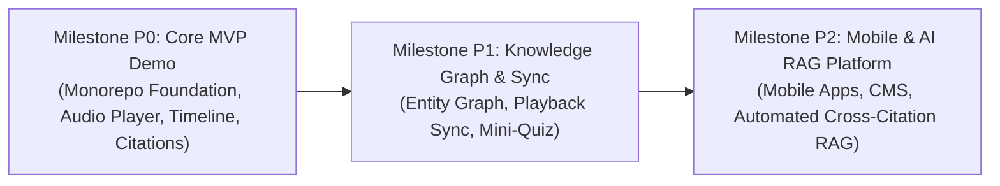

# Su-Ky — Project Delivery Roadmap & Milestone Specifications
## Monorepo Architecture & Feature Phasing (WDP301)

- **Project**: **Su-Ky** (Sử Ký — Vietnamese History Podcast & Interactive Knowledge Platform)
- **Monorepo Runtime**: Bun v1.4.0 + Turborepo 2.x
- **Core Stack**: Hono v4 (Bun Native), React 19 + Vite 8 + Tailwind CSS v4/shadcn/ui/Magic UI, Expo 57 + React Native 0.86 + Tamagui, PostgreSQL, Zod, TanStack Query v5
- **Document Version**: 1.0.0
- **Updated Date**: 2026-09-11
- **Status**: Approved & Baseline Locked

---

## 1. Executive Summary & Delivery Philosophy

The Su-Ky project delivery follows a strict milestone-driven engineering framework. Each milestone enforces non-negotiable definition of done (DoD) criteria: type safety across boundaries (`packages/shared`), verified migrations (`packages/db`), validated API endpoints (`apps/api`), and accessible, responsive user interfaces (`apps/web`).

---

## 2. Milestone P0: Core MVP & Flagship Historical Chronicle

### 2.1 Scope & Objectives
Deliver an end-to-end working platform capable of demonstrating the core value proposition: discovering, listening to, and reading historical podcasts organized by era with authentic source citations.

### 2.2 Functional Deliverables
1. **Interactive Historical Timeline (Dòng Thời Gian Tương Tác)**:
   - Dynamic era selector: Hồng Bàng, An Dương Vương, Bắc Thuộc, Ngô - Đinh - Tiền Lê, Lý, Trần, Hậu Lê, Tây Sơn, Nguyễn.
   - Filter episodes by selected dynasty and historical significance.
2. **Persistent Audio Player Component**:
   - Global sticky/bottom audio dock with play/pause, scrub slider, volume, playback speed adjustments (0.75x, 1x, 1.25x, 1.5x, 2x), and skip forwards/backwards (15s).
   - Dynamic track metadata hydration from API.
3. **Episode & Series Catalog**:
   - Series overview page with progress indicators and episode lists.
   - Flagship series: *"Hành Trình Dựng Nước: Từ Văn Lang đến Kỷ Nguyên Độc Lập"* (seeded data with 10–15 episodes).
4. **Episode Detail Experience**:
   - Synchronized transcript reading view with clickable timestamps.
   - Verified historical citations (*Đại Việt Sử Ký Toàn Thư*, *Khâm Định Việt Sử Thông Giám Cương Mục*, *Việt Nam Sử Lược*).
   - Terminology index & historical notes drawer for archaic titles and ancient geographic regions.

### 2.3 Technical Deliverables & Architecture
- **Workspaces Configured**:
  - `apps/api`: Hono v4 with type-safe routing, CORS, structured JSON logging, error boundaries, healthcheck (`/health`), and RPC export.
  - `apps/web`: React 19, Vite 8, Tailwind CSS v4, shadcn/ui, Magic UI, TanStack Query v5, Hono RPC client (`hc<AppType>`).
  - `apps/mobile`: Expo 57, React Native 0.86, Expo Router, Tamagui.
  - `packages/db`: PostgreSQL 17 schema (Drizzle ORM), seed scripts, database migrations, connection lifecycle pooling (`postgres.js`).
  - `packages/shared`: Shared Zod schemas, DTO interfaces, enum contracts for eras, categories, and citation status.
  - `packages/tsconfig`: Strict base, React, and Node/Bun TypeScript configurations.
- **Infrastructure & Tooling**:
  - `docker-compose.yml`: PostgreSQL 17 container with automated healthcheck and persistent volumes.
  - Turborepo pipelines: `build`, `dev`, `check-types`, `lint`, `test`, `db:generate`, `db:migrate`.

### 2.4 Definition of Done (DoD)
- [x] Zero type errors (`bun run check-types` exits with code 0 across all workspaces).
- [x] Clean Docker PostgreSQL boot and automated schema migration on fresh setup.
- [x] API healthcheck endpoint returns database status and latency metrics.
- [x] Audio streaming functionality operates reliably on modern desktop and mobile browsers.

---

## 3. Milestone P1: Interactive Entity Graph & Playback Ecosystem

### 3.1 Scope & Objectives
Deepen listener engagement by visualizing relationships between historical figures, battles, treaties, and dynasties, while introducing cross-device playback state synchronization.

### 3.2 Key Functional Epics

#### Epic 1: Interactive Entity Knowledge Graph (Bản Đồ Tri Thức Nhân Vật)
- **Node-Link Visualizer**: Dynamic interactive graph (Cytoscape.js or Force-Directed Canvas) mapping relationships between:
  - Figures (Vua, Tướng lĩnh, Học giả, Danh thần).
  - Historic Battles (Bạch Đằng, Chi Lăng, Ngọc Hồi - Đống Đa).
  - Dynasties & Alliances (Hôn nhân chính trị, Chiến tuyến đối kháng, Thầy trò).
- **Direct Navigation**: Clicking an entity node opens contextual mini-dossier, affiliated podcast episodes, and historical timeline anchor.

#### Epic 2: User Account & Listening Session Sync
- **Authentication**: Lightweight secure session auth (OAuth2 Google/GitHub + Magic Link).
- **Progress Tracking**: Periodic playback position beaconing (heartbeat every 10 seconds), resume listening on any device.
- **Library & Bookmarks**: Custom collections, bookmarking specific timestamps inside transcripts, favorite series.

#### Epic 3: Micro-Learning & Gamified Retention (Mini-Quiz)
- **3-Question Episode Reinforcement**: Non-intrusive 3-question multiple choice quizzes at episode conclusion.
- **Fact Cards**: Flashcards summarizing key milestones and quotes from original historical chronicles.

### 3.3 Technical Deliverables
- Database schema expansion: `users`, `listening_progress`, `bookmarks`, `figures`, `figure_relations`, `quizzes`, `quiz_questions`.
- Websocket or optimized HTTP PATCH beaconing for real-time progress state updates.
- Graph layout computation optimization to maintain 60 FPS on client devices.

### 3.4 Definition of Done (DoD)
- [ ] Sub-50ms latency on listening progress sync endpoints.
- [ ] Graph visualizer renders up to 500 nodes and 1,200 edges smoothly without UI jank.
- [ ] Full test coverage for relationship traversal queries and session authentication guards.

---

## 4. Milestone P2: Mobile Ecosystem & Automated AI RAG Pipeline

### 4.1 Scope & Objectives
Scale distribution to mobile platforms and empower editorial teams with an AI-assisted Retrieval-Augmented Generation (RAG) pipeline for scriptwriting, source cross-validation, and citation checking against digitized canonical texts.

### 4.2 Key Functional Epics

#### Epic 1: Cross-Platform Mobile Application
- **Framework**: React Native (Expo) or Flutter, sharing validation models and contracts from `packages/shared`.
- **Offline Mode**: Local caching of audio files and transcripts for airplane/commuter listening.
- **Background Playback & Lock Screen Controls**: System media controls, CarPlay / Android Auto readiness.

#### Epic 2: Editorial CMS & Publishing Studio
- **Role-Based Access Control (RBAC)**: Admin, Historian/Editor, Voice Artist, Reviewer.
- **Audio Asset Pipeline**: S3/R2 object storage integration, automated waveform generation, loudness normalization (EBU R128 standard).
- **Transcript Synchronization Tool**: Web-based alignment tool linking audio timestamps to text paragraphs.

#### Epic 3: Historical Citation RAG & Verification Pipeline
- **Vector Database**: PostgreSQL with `pgvector` extension storing chunked and embedded classical historical records (*Đại Việt Sử Ký Toàn Thư*, *Khâm Định Việt Sử*, *Lịch Triều Hiến Chương Loại Chí*).
- **Source Verification Agent**:
  - Script draft ingestion -> Semantic search across historical corpus.
  - Automatic detection of historical anachronisms or misattributed events.
  - Automated footnoting with confidence scores and source volume/page references.

### 4.3 Technical Deliverables
- `apps/mobile`: Mobile client workspace integrated into Turborepo.
- `apps/cms`: Secured administration interface with rich markdown/audio editing capabilities.
- `packages/rag`: Embeddings generator, vector store abstractions, and LLM reasoning prompts with zero hallucination constraints.

### 4.4 Definition of Done (DoD)
- [ ] RAG pipeline achieves >90% precision on historical reference retrieval benchmark tests.
- [ ] Mobile app achieves background audio persistence on iOS & Android.
- [ ] End-to-end automated deployment pipeline with CI/CD for web, api, and mobile staging tracks.

---

## 5. Work Breakdown Structure & Package Matrix

| Package / Workspace | Milestone P0 | Milestone P1 | Milestone P2 |
| :--- | :--- | :--- | :--- |
| `apps/api` | REST/RPC endpoints, public catalog, health check | Auth routes, sync beacon, quiz APIs, graph queries | RAG retrieval API, CMS endpoints, media upload presign |
| `apps/web` | Public portal, player dock, timeline, episode view | User dashboard, interactive graph view, quiz widget | CMS Studio integration, responsive web polish |
| `apps/mobile` | *Not started* | Architectural prototyping | Full native audio app with background controls |
| `packages/db` | Core models (series, episodes, timeline, citations) | User progress, bookmarks, graph entity relations | Vector embeddings (`pgvector`), CMS audit logs |
| `packages/shared` | Core DTOs, Zod validators, pagination schemas | Auth DTOs, Graph schemas, Quiz DTOs | RAG payload contracts, CMS management schemas |
| `packages/rag` | *Not started* | *Not started* | Embedding generation, citation verification pipeline |

---

## 6. Risk Management & Engineering Mitigations

1. **Risk: Copyright and Historical Source Authenticity**
   - *Mitigation*: Strictly prioritize public-domain Vietnamese historical chronicles prior to 1954. All citations must reference specific volumes, chapters, and translated editions.
2. **Risk: Audio Streaming Latency & Bandwidth Costs**
   - *Mitigation*: Employ CDN caching (Cloudflare) with range-request chunking for MP3/AAC audio files. Implement progressive audio pre-buffering in the client player.
3. **Risk: Frontend Performance with Complex Entity Graphs (P1)**
   - *Mitigation*: Offload layout calculations to Web Workers. Use Level of Detail (LoD) rendering to hide peripheral nodes when zoomed out.
4. **Risk: AI Hallucinations in Historical Verification (P2)**
   - *Mitigation*: Strict temperature (0.0), ground all assertions exclusively within retrieved source chunks, and require manual human-historian sign-off before publishing.
