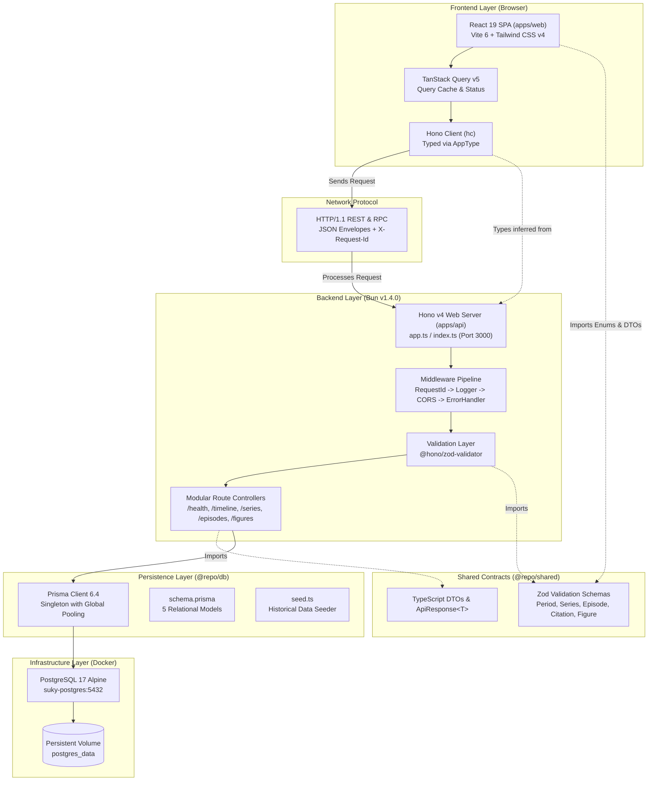
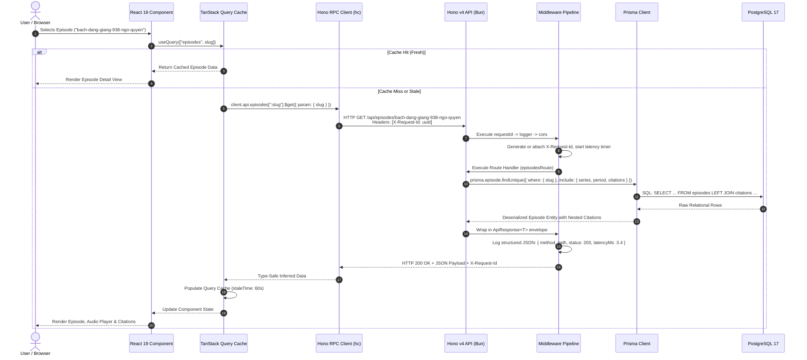

# Su-Ky Monorepo — System Architecture Specification

> **Architectural Topology, End-to-End Data Flow, and Infrastructure Specifications**  
> **Platform:** Su-Ky (Sử Ký) Vietnamese History Podcast & Interactive Chronicle  
> **Core Stack:** Turborepo 2.4 + Bun 1.4.0 + Hono 4.7 + React 19 + Prisma 6.4 + PostgreSQL 17  
> **Date:** 2026-09-11 | **Status:** Production Architecture Baseline

---

## 1. Architectural Overview & Design Philosophy

The Su-Ky platform is engineered to deliver sub-100ms API responses, instant frontend hydration, and compile-time type safety spanning the entire software lifecycle. To accomplish this, the system avoids traditional code-generation or manually replicated DTO patterns, employing a unified TypeScript type pipeline directly derived from database models and backend route definitions.

```
PostgreSQL 17 ──> Prisma ORM ──> Hono v4 (Bun) ──[hc RPC]──> React 19 + TanStack Query
```

### Core Architectural Pillars
1. **Unified Monorepo Boundary:** Single repository housing frontend applications, backend services, and shared libraries orchestrated by Turborepo with strict Bun workspace isolation.
2. **End-to-End Type Inference:** Backend route definitions produce an `AppType` contract consumed directly by the frontend client (`hc<AppType>`), ensuring instant compile-time feedback on any API contract changes.
3. **High-Performance Runtime:** Powered by Bun v1.4.0 for rapid script execution, native TypeScript evaluation without transpile steps, and high-throughput HTTP serving.
4. **Relational Integrity & Sourcing:** PostgreSQL 17 managed via Prisma ORM to preserve strict referential integrity between historical periods, podcast series, episodes, and primary source citations.

---

## 2. Monorepo Topology Diagram



---

## 3. End-to-End Data Flow Pipeline

The interaction sequence below traces a complete request from a user viewing a historical episode through database retrieval and frontend rendering.



---

## 4. Layer-by-Layer Architectural Deep Dive

### 4.1 Layer 1: PostgreSQL 17 Persistence Layer
- **Container Architecture:** Defined in `compose.yaml` using `postgres:17-alpine`.
- **Healthcheck Automation:** Configured with `pg_isready -U postgres -d suky_dev` with 5s test intervals and 10s start period.
- **Relational Integrity:**
  - `periods`: Historical epochs with start/end years and order index.
  - `series`: Podcast series linked to `periods.id` with `onDelete: SetNull`.
  - `episodes`: Audio episodes linked to `series.id` (`onDelete: Cascade`) and `periods.id` (`onDelete: SetNull`).
  - `citations`: Scholarly source excerpts linked to `episodes.id` (`onDelete: Cascade`).
  - `figures`: Historical figures and biographic milestones.

---

### 4.2 Layer 2: Prisma ORM Data Access Layer (`packages/db`)
- **Type Generation:** Prisma Client generates TypeScript models matching the PostgreSQL relational schema into `node_modules/@prisma/client`.
- **Singleton Connection Management:** In `packages/db/src/client.ts`, the client is cached on `globalThis.prisma` during non-production runs, preventing connection pool exhaustion during hot reload events.
- **Query Optimization & Eager Loading:**
  - Uses `include` and `_count` aggregations to fetch related citations and calculate episode counts in a single database round-trip, eliminating N+1 queries.
- **Seeding Pipeline (`packages/db/src/seed.ts`):**
  - Idempotent data seeding using `upsert` and `createMany` with `skipDuplicates: true`.

---

### 4.3 Layer 3: Hono v4 Backend Service Layer (`apps/api`)
- **Native Bun Execution:** Runs natively on Bun (`bun src/index.ts`) with zero compilation lag and sub-millisecond route dispatching.
- **Middleware Pipeline:**
  1. `requestId()`: Extracts incoming `X-Request-Id` or generates a standard UUID v4.
  2. `requestLogger()`: Emits high-precision structured JSON logs (`{ level, timestamp, reqId, method, path, status, latencyMs }`).
  3. `corsConfig()`: Handles cross-origin negotiation with automatic localhost development origin allowances.
  4. `errorHandler()`: Normalizes `ZodError` (400), `HTTPException` (400-502), and unhandled runtime exceptions (500) into a uniform `ApiResponse` envelope.
- **Validation Guard:** Integrates `@hono/zod-validator` (`zValidator`) to validate query strings, parameters, and bodies at the boundary.

---

### 4.4 Layer 4: Hono RPC Protocol Layer (`AppType`)
- **Contract Definition:** `apps/api/src/app.ts` chains all route controllers and exports `AppType = typeof routes`.
- **Zero Client Runtime Bloat:** Only TypeScript types are exported via `apps/api/package.json` (`"exports": { "./types": "./src/app.ts" }`), preventing backend code from leaking into the frontend build.
- **Client Instantiation:** In `apps/web/src/lib/api.ts`:
  ```ts
  import { hc } from "hono/client";
  import type { AppType } from "@repo/api/types";

  export const client = hc<AppType>(import.meta.env.VITE_API_URL || "http://localhost:3000");
  ```
- **Autocomplete & Type Safety:** Calling `client.api.episodes.$get({ query: ... })` provides complete compile-time validation of query fields and return shapes without manual DTO maintenance.

---

### 4.5 Layer 5: React 19 + TanStack Query Presentation Layer (`apps/web`)
- **Modern React 19 Baseline:** Leverages modern hooks and concurrent rendering capabilities.
- **Asynchronous Cache Management (`TanStack Query v5`):**
  - Configured with `staleTime: 60000` (1 minute) to minimize redundant network calls.
  - Automatic background refetching and status management (`isLoading`, `error`, `data`).
- **Tailwind CSS v4 Styling:**
  - Modern CSS-first integration via `@tailwindcss/vite` without legacy config files.
  - Custom dark theme optimized for reading and cultural gravity (`#0B0D13` obsidian lacquer background).

---

## 5. Network, Security & Reliability Architecture

```
Client Browser                  Hono API Service (Bun)                 PostgreSQL 17
     │                                    │                                  │
     │── 1. HTTP GET (X-Request-Id) ─────►│                                  │
     │                                    │── 2. Validate Origin (CORS)      │
     │                                    │── 3. Validate Query (Zod)        │
     │                                    │── 4. Connection Pool Query ─────►│
     │                                    │                                  │
     │                                    │◄─ 5. Relational Record Stream ───│
     │                                    │── 6. Log JSON with Latency       │
     │◄── 7. HTTP 200 (ApiResponse<T>) ───│                                  │
```

1. **Correlation Tracing:** Every HTTP transaction carries an `X-Request-Id` across all hops. This ID is logged by backend middleware and returned in the response headers and metadata envelope for distributed tracing.
2. **Graceful Database Degradation:** The `/health` endpoint executes an active database ping (`SELECT 1`) bounded by a 2000ms timeout race. If the database is unresponsive, the service gracefully degrades, returning `503 Service Unavailable` with `status: "degraded"` while keeping the HTTP process alive.
3. **CORS Security:**
   - Production restricts origins strictly to `process.env.CORS_ORIGIN`.
   - Development permits dynamic matching for local developer ports (`http://localhost:*`).

---

## 6. Infrastructure & Deployment Architecture

### 6.1 Development Runtime
- **Database:** Managed via `docker compose up -d` running PostgreSQL 17 Alpine on port `5432`.
- **Backend API:** Managed via `bun --watch src/index.ts` in `apps/api` with instant process reloads.
- **Frontend SPA:** Managed via Vite 6 in `apps/web` with Hot Module Replacement (HMR).
- **Orchestration:** Single root command `bun run dev` boots all workspaces concurrently via Turborepo.

### 6.2 Production Build Strategy
- **Prisma Client:** `bun run db:generate` compiles native query engines and types.
- **Backend Compilation:** `bun build src/index.ts --outdir dist --target bun` packages `apps/api` into a standalone production executable.
- **Frontend Compilation:** `tsc -b && vite build` in `apps/web` generates optimized static assets into `apps/web/dist`.
- **Docker Production Image:** Can be packaged into minimal multi-stage Docker containers with distroless or Alpine bases.
