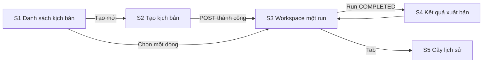

# Script Workflow: Đặc tả UX / màn hình (Moderator)

Tài liệu cho FE (`apps/web`) và designer: cần làm những màn hình nào, mỗi màn có gì, hành vi và trạng thái ra sao. Đọc cùng [script-workflow-api.md](../api-docs/script-workflow-api.md) (schema, mã lỗi) và [design-guidelines.md](../design-guidelines.md) (token màu, font, a11y).

Phạm vi: chỉ phần **tạo kịch bản văn bản** (3 tập). Không có audio trong hệ thống. Moderator copy kịch bản sang ElevenLabs. Chưa có upload PDF/DOC, chưa có liên kết Series/Episode.

## 1. Người dùng và mục tiêu

| Mục | Nội dung |
|---|---|
| Người dùng | Moderator (role `moderator`; Admin không vào) |
| Mục tiêu | Từ một chủ đề lịch sử, nhận về kịch bản 3 tập văn nói đã được kiểm chứng, đưa sang ElevenLabs |
| Điều người dùng kiểm soát | 3 cổng duyệt: chọn trọng tâm kể (Gate 0), biên tập dàn ý (Gate 1), phê duyệt xuất bản (Gate 2) |
| Nỗi lo chính | AI bịa chi tiết lịch sử. Giao diện phải làm lộ nguồn, mức tin cậy và câu chưa được kiểm chứng |
| Đặc điểm | Mỗi bước AI chạy vài chục giây đến vài phút. Giao diện phải có trạng thái chờ rõ ràng, không để người dùng tưởng bị treo |

## 2. Sơ đồ màn hình và điều hướng



Route gợi ý (react-router 7, đặt cùng nhóm Moderator):

| Route | Màn hình |
|---|---|
| `/moderator/script-workflows` | S1 Danh sách |
| `/moderator/script-workflows/new` | S2 Tạo mới |
| `/moderator/script-workflows/:id` | S3 Workspace (tab: `Quy trình`, `Cây lịch sử`, `Nhật ký`) |
| `/moderator/script-workflows/:id/publication` | S4 Kết quả xuất bản |

Route guard: chưa đăng nhập đưa về đăng nhập. Đăng nhập nhưng không phải `moderator` hiện trang "Bạn không có quyền" (không hiện menu Moderator). `404` từ API hiện trang "Không tìm thấy kịch bản" (gộp cả trường hợp id của người khác).

## 3. Các màn hình

### S1. Danh sách kịch bản

API: `GET /api/script-workflows?page&limit`.

```
┌──────────────────────────────────────────────────────────────┐
│ Kịch bản của tôi                         [+ Tạo kịch bản mới]│
├──────────────────────────────────────────────────────────────┤
│ Chủ đề                      Trạng thái           Cập nhật    │
│ Chiến thắng Bạch Đằng 1288  ● Chờ bạn duyệt      2 phút trước│
│                             Gate 0 · Chọn trọng tâm          │
│ Khởi nghĩa Lam Sơn          ◌ Đang chạy          5 phút trước│
│                             Bước 3/7 · Trích fact            │
│ Hai Bà Trưng                ✓ Hoàn tất           hôm qua     │
│ Trận Đống Đa                ✕ Thất bại           hôm qua     │
├──────────────────────────────────────────────────────────────┤
│ « 1 2 3 »                                                    │
└──────────────────────────────────────────────────────────────┘
```

- Mỗi dòng: chủ đề (cắt 2 dòng), badge trạng thái, dòng phụ "bước hiện tại", thời điểm cập nhật (tương đối).
- Nhấn dòng để vào S3. Dòng `WAITING_FOR_HUMAN` nổi bật (viền vàng) và có nhãn "Chờ bạn duyệt" để Moderator thấy việc cần làm.
- Phân trang theo `meta.page/limit/total`. Mặc định 20 dòng.
- Trạng thái rỗng: minh hoạ + câu "Chưa có kịch bản nào" + nút **Tạo kịch bản mới**.
- Trạng thái tải: skeleton 5 dòng. Lỗi mạng: banner + nút **Thử lại**.
- Danh sách này không tự cập nhật realtime. Refetch khi cửa sổ lấy lại focus (react-query `refetchOnWindowFocus`).

Ánh xạ badge trạng thái:

| `status` | Nhãn | Màu token | Biểu tượng |
|---|---|---|---|
| `PENDING` | Chuẩn bị | `--color-text-muted` | đồng hồ |
| `RUNNING` | Đang chạy | Cobalt `#3B82F6` | spinner |
| `WAITING_FOR_HUMAN` | Chờ bạn duyệt | Amber `#F59E0B` | bàn tay/chuông |
| `COMPLETED` | Hoàn tất | Emerald `#10B981` | dấu tick |
| `FAILED` | Thất bại | Rose `#EF4444` | dấu X |

Không dùng màu làm tín hiệu duy nhất: luôn kèm biểu tượng và chữ (WCAG).

### S2. Tạo kịch bản

API: `POST /api/script-workflows`. Tuỳ chọn `GET /health` để kiểm tra AI.

```
┌──────────────────────────────────────────────┐
│ Tạo kịch bản podcast                         │
│                                              │
│ Chủ đề lịch sử                               │
│ ┌──────────────────────────────────────────┐ │
│ │ Chiến thắng Bạch Đằng năm 1288           │ │
│ └──────────────────────────────────────────┘ │
│ 31 / 10000 ký tự   (tối thiểu 3)             │
│                                              │
│ Kết quả: 3 tập, văn nói, có nguồn tham khảo. │
│ Bạn sẽ duyệt ở 3 điểm trong quá trình.       │
│                                              │
│            [Hủy]   [Bắt đầu tạo kịch bản]    │
└──────────────────────────────────────────────┘
```

- Một ô nhập `topic` (textarea, tự giãn). Đếm ký tự. Nút chính bị khoá khi dưới 3 ký tự (sau `trim`) hoặc vượt 10000.
- Không có ô nguồn tự cung cấp (tính năng chưa có).
- Khi gửi: nút chuyển sang trạng thái "Đang khởi tạo…", khoá form để tránh gửi hai lần. Thành công thì chuyển sang S3 với `id` trả về.
- Trước khi gửi, gọi `GET /health`. Nếu `data.ai = "unavailable"` hiện cảnh báo vàng "Hệ thống AI chưa sẵn sàng, chưa thể tạo kịch bản" và khoá nút. Cách này tránh người dùng gõ xong mới nhận `503`.
- Lỗi: `400` hiện `message` tại ô `topic` (body lỗi chỉ có `{ error_code, message }`, không có lỗi theo field; giới hạn 3 đến 10000 ký tự đã chặn ở client bằng schema dùng chung); `503` hiện cảnh báo như trên, cho phép thử lại; lỗi khác hiện toast kèm mã yêu cầu (header `X-Request-Id`) để báo hỗ trợ.

### S3. Workspace của một kịch bản (màn chính)

API: `GET /:id` (nguồn sự thật), `/events/stream` (kích hoạt refetch), `POST /:id/step-decisions`.

Bố cục desktop: thanh tiêu đề, stepper 7 bước bên trái (hoặc phía trên khi hẹp), panel nội dung bước ở giữa, thanh hành động dính ở đáy panel, tab phụ `Cây lịch sử` và `Nhật ký`.

```
┌────────────────────────────────────────────────────────────────┐
│ ← Danh sách │ Chiến thắng Bạch Đằng 1288      ● Chờ bạn duyệt │
├───────────────┬────────────────────────────────────────────────┤
│ ① Tư vấn  ◆G0 │ Gate 0 · Duyệt nguồn & chọn trọng tâm kể       │
│ ② Thẩm định ✓ │ [ v1 ] [ v2 ]            phiên bản hiện tại: v2│
│ ③ Trích fact ✓│ ───────────────────────────────────────────── │
│ ④ Dàn ý   ◆G1 │  (nội dung theo bước, xem mục 4)               │
│ ⑤ Viết    ○   │                                                │
│ ⑥ Văn nói ○   │                                                │
│ ⑦ Kiểm định◆G2│                                                │
│               ├────────────────────────────────────────────────┤
│ Quy trình     │ [Làm lại…]  [Sửa tay]        [Duyệt & tiếp tục]│
│ Cây │ Nhật ký │                                                │
└───────────────┴────────────────────────────────────────────────┘
```

#### 3.1 Stepper (7 bước)

Luôn vẽ đủ 7 bước (API luôn trả 7). Mỗi bước hiện: số thứ tự, tên tiếng Việt, trạng thái, và dấu cổng `◆` nếu `reviewPolicy = REVIEW_REQUIRED`.

| `type` | Tên hiển thị | Ghi chú |
|---|---|---|
| `RESEARCHER` | Tư vấn biên tập | Gate 0 |
| `SOURCE_EVALUATOR` | Thẩm định nguồn | Tự động |
| `FACT_EXTRACTOR` | Trích xuất sự kiện | Tự động |
| `STORY_PLANNER` | Dàn ý 3 tập | Gate 1 |
| `SCRIPT_WRITER` | Viết kịch bản | Tự động |
| `ORALIZER` | Chuyển văn nói | Tự động |
| `FACT_CHECKER` | Kiểm định và xuất bản | Gate 2 |

Hiển thị theo `StepStatus`:

| `status` | Biểu diễn trên stepper | Panel khi chọn bước |
|---|---|---|
| `PENDING` | Vòng tròn rỗng, chữ mờ | "Chưa đến bước này" |
| `QUEUED` | Đồng hồ | Skeleton + "Đang xếp hàng" |
| `RUNNING` | Spinner | Skeleton + "AI đang xử lý…" kèm đồng hồ đếm thời gian đã chạy |
| `WAITING_FOR_HUMAN` | Viên ngọc vàng nhấp nháy nhẹ | Nội dung + thanh hành động (chỉ ở bước có cổng) |
| `COMPLETED` | Dấu tick xanh | Nội dung chỉ đọc, tab version |
| `FAILED` | Dấu X đỏ | Khối lỗi: `errorMessage` + nút **Làm lại** (`RERUN`) |
| `STALE` | Mờ, gạch ngang nhẹ, nhãn "Cần chạy lại" | Nội dung cũ chỉ đọc kèm cảnh báo "Bước trước đã đổi, kết quả này không còn khớp" |

Hành vi:
- Tự chọn bước đang `WAITING_FOR_HUMAN` (hoặc `FAILED`, hoặc bước đang chạy gần nhất). Người dùng vẫn bấm xem được bước khác. Bước đang xem không bị nhảy khi dữ liệu cập nhật, chỉ hiện chấm thông báo ở bước mới cần chú ý.
- Bước `PENDING` không bấm vào xem nội dung được (disabled, có tooltip).

#### 3.2 Cập nhật dữ liệu và trạng thái chờ

- Mở S3: gọi `GET /:id`. Nếu run chưa `COMPLETED`/`FAILED`, mở SSE `/:id/events/stream` (`withCredentials: true`). Mỗi `workflow-event` thì refetch `GET /:id` (gộp nhiều event trong 500 ms thành một lần refetch). Nhận `workflow-done` thì refetch lần cuối rồi `eventSource.close()`.
- Nếu SSE đứt nhiều lần liên tiếp: hạ cấp sang polling `GET /:id` mỗi 3 giây và hiện chấm "Mất kết nối realtime". Không chặn người dùng.
- Nhật ký (tab `Nhật ký`) lấy từ `GET /:id/events` và nối thêm các event SSE, hiển thị dạng timeline.
- Khi `RUNNING` quá 5 phút không có event mới: hiện dòng nhắc "Bước này đang chạy lâu hơn bình thường" (không huỷ được, vì API chưa có huỷ).
- Trạng thái run `FAILED` hiện banner đỏ ở đầu trang: "Kịch bản dừng ở bước <tên>", `errorMessage`, và hướng dẫn "Bấm **Làm lại** hoặc tạo kịch bản mới". Ghi chú: lỗi tạm thời đã được hệ thống tự thử lại tối đa 3 lần trước khi báo thất bại.

#### 3.3 Chuyển phiên bản (version switcher)

- Mỗi bước có tab `v1, v2, …` từ `versions[]` (API trả mới nhất đầu). Mặc định chọn `currentVersion`.
- Nhãn: `v2 · hiện tại`, `v1 · đã duyệt` (khi `approvedVersion`), `v1` thường.
- Xem phiên bản cũ thì panel ở chế độ **chỉ đọc** và hiện dải thông tin "Bạn đang xem v1. Hành động áp dụng cho v2." Thanh hành động vô hiệu hoá. Có nút "Về phiên bản hiện tại".
- Hiển thị `humanFeedback` (lý do làm lại / ghi chú sửa tay) bên dưới tab của version tương ứng.
- Nút **So sánh với phiên bản trước** là tuỳ chọn (phase sau). Bản đầu chỉ cần xem từng version.

#### 3.4 Thanh hành động (chỉ ở bước có cổng và `WAITING_FOR_HUMAN`)

| Nút | Điều kiện hiện | Gọi API | Ghi chú |
|---|---|---|---|
| **Duyệt & tiếp tục** | Luôn (Gate 0/1/2) | `CONTINUE` | Gate 0: bắt buộc đã chọn trọng tâm. Gate 2: nhãn đổi thành **Duyệt & xuất bản** |
| **Làm lại…** | Luôn | `RERUN` | Mở hộp thoại nhập feedback (bắt buộc, ít nhất 1 ký tự) |
| **Sửa tay** | Gate 0, Gate 1, Gate 2 | `DIRECT_EDIT` | Mở trình sửa (xem 3.5). Gate 0 sửa danh mục nguồn (4.1). Không có ở bước tự động |

Quy tắc chung:
- `baseVersion` luôn lấy từ `currentVersion` của bước ở lần fetch mới nhất, không lấy từ tab đang xem.
- Khi gửi: khoá toàn bộ nút, nút bấm hiện spinner. Tránh bấm đúp.
- Sau `CONTINUE` hoặc `RERUN` thành công: hiện toast ngắn, refetch, stepper chuyển sang bước kế. Panel chuyển sang trạng thái chờ.
- `409 CONFLICT`: hộp thoại "Kịch bản vừa thay đổi ở nơi khác" + nút **Tải lại**. Tự refetch, giữ nguyên nội dung người dùng đang nhập (feedback / bản sửa) để họ gửi lại.
- `400 VALIDATION_ERROR` (chủ yếu `DIRECT_EDIT`): hiện `message` do server trả, giữ nguyên bản sửa. Lỗi theo từng field do client tự bắt bằng schema `@repo/shared` trước khi gửi.
- `403/401`: đưa về đăng nhập hoặc trang không có quyền.

#### 3.5 Hộp thoại "Làm lại" và trình "Sửa tay"

Làm lại:
- Textarea "Bạn muốn AI sửa điều gì?" (bắt buộc) + gợi ý chip: "Ngắn gọn hơn", "Nhấn mạnh nhân vật", "Bám sát chính sử hơn".
- Cảnh báo hiển thị trước khi xác nhận khi có bước phía sau: "Các bước sau (<danh sách tên>) sẽ cần chạy lại" (vì chúng chuyển `STALE`). Phiên bản cũ vẫn được giữ.
- Nút **Gửi cho AI** / **Hủy**.

Sửa tay (`DIRECT_EDIT`):
- `editedOutputJson` phải đúng schema của bước, nên **bản đầu dùng form theo trường của từng bước** (xem mục 4) thay vì JSON thô. Với bước chưa kịp làm form, dùng trình sửa JSON có kiểm tra cú pháp, hiện lỗi schema do server trả về.
- Ô `note` tuỳ chọn "Ghi chú thay đổi".
- Sau khi lưu thành công: version mới `v(n+1)` xuất hiện, bước **vẫn** chờ duyệt, Moderator tiếp tục bấm **Duyệt & tiếp tục**. Hiện toast "Đã lưu v(n+1). Chưa duyệt."
- Hủy khi có thay đổi chưa lưu: hỏi xác nhận.

### S4. Kết quả xuất bản

API: `GET /:id/publications` (lấy `finalScript`), vẫn có thể dùng `GET /:id` để lấy chi tiết từng tập.

```
┌────────────────────────────────────────────────────────────┐
│ ✓ Đã xuất bản · 5.400 từ · ~36 phút      [Copy toàn bộ]    │
│ Duyệt bởi: <tên Moderator> · 08/10/2026 15:30              │
├────────────────────────────────────────────────────────────┤
│ [Tập 1] [Tập 2] [Tập 3]                                    │
│ Tập 1: <episodeTitle>              1.800 từ · ~12 phút     │
│ ┌────────────────────────────────────────────────────────┐ │
│ │ <spokenNarration>                                      │ │
│ └────────────────────────────────────────────────────────┘ │
│ Ghi chú nhịp đọc: <breathAndPacingNotes>                   │
│                                  [Copy tập này]            │
│ Nguồn tham khảo: …                                         │
└────────────────────────────────────────────────────────────┘
```

- Vào được khi run `COMPLETED` (có ít nhất 1 publication). Nếu chưa xuất bản thì chuyển hướng về S3.
- Nút **Copy toàn bộ** chép `finalScript` (định dạng `# Tiêu đề` + nội dung, các tập cách nhau `---`). **Copy tập này** chép riêng `spokenNarration` của tập đang xem, không kèm tiêu đề, để dán thẳng vào ElevenLabs. Sau khi chép: đổi nhãn "Đã chép" 2 giây và thông báo cho trình đọc màn hình (`aria-live`).
- Chi tiết từng tập (tiêu đề, số từ, thời lượng, ghi chú nhịp đọc) lấy từ `ORALIZER` ở node được duyệt (xem 5.2). `finalScript` chỉ có văn bản ghép, không có số liệu từng tập.
- Khối **Nguồn tham khảo** liệt kê từ `SOURCE_EVALUATOR.evaluatedSources` (tên, tier, độ tin cậy, đường dẫn nếu có) để Moderator đối chiếu.
- Có nhiều publication (xuất bản lại node khác): hiện dropdown chọn bản, mặc định bản mới nhất.

### S5. Cây lịch sử (tab trong S3, không bắt buộc ở bản đầu)

API: `GET /:id/tree`.

- Hiển thị cây node theo `parentVersionId`: mỗi node là một thẻ nhỏ (tên bước, `v`, thời điểm), node đã duyệt (`approved`) có viền ngọc, node thuộc bước `STALE` mờ.
- Nhánh rẽ xuất hiện khi `RERUN`/`DIRECT_EDIT`. Bấm node mở panel chỉ đọc của đúng version đó (đưa về S3, chọn bước và version tương ứng).
- Phục vụ truy vết, không có hành động ghi.

## 4. Panel nội dung theo bước (render `outputJson`)

Schema đầy đủ ở mục 5 của tài liệu API. Dưới đây là cách trình bày.

### 4.1 `RESEARCHER` · Gate 0 (quan trọng nhất)

Hai khối:
1. **Danh mục nguồn** (`sourcesCatalogue`): bảng/thẻ. Mỗi nguồn: tên, tác giả/xuất xứ, nhãn tier (dùng `SOURCE_TIER_LABELS`), thanh điểm tin cậy 1 đến 10, dấu "Nguồn khẳng định chính" nếu `isPrimaryAssertionSource`, ghi chú đối chiếu, liên kết `url` (mở tab mới, `rel="noopener noreferrer"`). Cho phép lọc theo tier và sắp xếp theo điểm. **Moderator thêm, sửa, xoá được nguồn** (AI chỉ đề xuất, không phụ thuộc hoàn toàn vào AI):
   - **Thêm / Sửa:** hộp thoại form đủ các trường trên (tier chọn từ `SOURCE_TIER_LABELS`, điểm 1 đến 10, `url` phải hợp lệ). Nguồn thêm tay có `id` do client sinh, không trùng `id` đang có.
   - **Xoá:** xác nhận nhẹ, có toast "Hoàn tác" trong phiên.
   - Thay đổi chỉ nằm ở bản nháp phía client cho tới khi bấm **Lưu chỉnh sửa**: gửi `DIRECT_EDIT` với toàn bộ `editedOutputJson` (giữ nguyên `narrativeMenu` và các trường khác). Lưu xong có version mới `v(n+1)`, bước vẫn chờ duyệt. Hiện chỉ báo "Có thay đổi chưa lưu"; bấm **Duyệt & tiếp tục** khi còn nháp chưa lưu thì hỏi lưu trước.
   - Xoá hết nguồn rồi duyệt: cảnh báo "Không còn nguồn nào" và yêu cầu xác nhận.
   - Chỉ sửa được ở Gate 0. Danh mục sau thẩm định (`SOURCE_EVALUATOR`) là bước tự động, chỉ đọc.
2. **Menu trọng tâm kể** (`narrativeMenu`): nhóm radio dạng thẻ. Mỗi thẻ: nhãn trọng tâm, mô tả góc kể, lý do đề xuất, tiêu đề series, 3 tiêu đề tập. Cuối nhóm có lựa chọn **Tự nhập** (`CUSTOM`).

Biểu mẫu chọn:
- Chọn một thẻ thì điền sẵn các ô `seriesTitle` và 3 ô `episodeTitles` (cho phép sửa).
- Chọn **Tự nhập** thì các ô trống, bắt buộc điền cả 4 ô.
- Ô `editorialNotes` (ghi chú biên tập, tuỳ chọn) và ô `incomingGuidance` (chỉ dẫn cho AI ở bước kế, tuỳ chọn).
- **Duyệt & tiếp tục** bị khoá cho tới khi: có lựa chọn, `seriesTitle` không rỗng, đủ 3 tiêu đề tập không rỗng.
- Payload gửi: `CONTINUE` kèm `narrativeSelection` (`selectedFocusType` là `focusType` của thẻ hoặc `CUSTOM`).
- Hiển thị thêm `initialResearchQuestions` ở khối phụ "Câu hỏi nghiên cứu ban đầu" (thu gọn được).

Trường hợp biên: `narrativeMenu` rỗng hoặc `sourcesCatalogue` rỗng: hiện cảnh báo vàng "AI không tìm được đủ dữ liệu" và khuyến nghị **Làm lại** hoặc **Tự nhập**.

### 4.2 `SOURCE_EVALUATOR` (chỉ đọc)

- Bảng nguồn đã thẩm định: tier, điểm tin cậy, vai trò (`DISCOVERY` = nguồn khám phá, `CLAIM_SUPPORT` = nguồn khẳng định), cờ `echoChamberFlag` (biểu tượng cảnh báo "Có thể là vòng lặp trích dẫn"), danh sách chi tiết còn tranh luận (`debatedDetails`).
- Khối cảnh báo: `singleSidedSourceWarnings` (vàng), `flaggedInsufficientSources` (đỏ). `crossVerificationSummary` là đoạn tóm tắt.

### 4.3 `FACT_EXTRACTOR` (chỉ đọc)

- Tab con: `Thẻ sự kiện`, `Niên biểu`, `Nhân vật`, `Khoảng trống`.
- Thẻ sự kiện: tuyên bố (`claim`), niên đại và địa điểm, nhãn độ chắc chắn (`CONFIRMED` xanh, `DEBATED` vàng, `INSUFFICIENT` đỏ), trích dẫn gốc (`citationSnippet`) và nguồn (`sourceReference`). Niên đại dùng font mono theo design guideline.
- Niên biểu: dòng thời gian dọc, mỗi mục liên kết sang thẻ sự kiện theo `factCardId`.
- Nhân vật: tên, vai trò, lập trường lịch sử. Khoảng trống: danh sách `identifiedResearchGaps`.

### 4.4 `STORY_PLANNER` · Gate 1

- Tiêu đề series, trọng tâm kể, huy hiệu "3 tập".
- 3 thẻ tập (accordion hoặc tab). Mỗi tập: tiêu đề, câu hỏi trung tâm, **chu kỳ SPDC** hiển thị 4 ô (Bối cảnh / Vấn đề / Quyết định / Hệ quả), danh sách nhịp kể (`narrativeBeats`), kế hoạch nhịp (`summaryMoments` kể lướt vs `detailedSceneMoments` kể chi tiết), và `hookEnd` (câu móc cuối tập).
- Sửa tay: form gồm các trường trên; mảng cho phép thêm/xoá/sắp xếp dòng. Giữ đúng 3 tập, `episodeNumber` cố định, `scale` cố định, không cho người dùng đổi hai trường này.

### 4.5 `SCRIPT_WRITER` (chỉ đọc)

- 3 tab tập: tiêu đề, `narration`, số từ, thời lượng ước tính. Tổng từ ở đầu.
- Đây là bản trung gian, chưa phải văn nói cuối. Gắn nhãn "Bản nháp trước khi chuyển văn nói".

### 4.6 `ORALIZER` (chỉ đọc)

- 3 tab tập: `spokenNarration` (cỡ chữ đọc dài, dòng không quá ~70 ký tự), `breathAndPacingNotes`, số từ, thời lượng.
- Hiển thị kết quả linter dưới dạng huy hiệu "Đạt kiểm tra văn nói" (khi có event `step.oralizer.lint_passed`) hoặc "Đã tự sửa dấu câu 1 lần" (khi có `step.oralizer.lint_failed` rồi `lint_passed`). Lấy từ tab Nhật ký, không bắt buộc ở bản đầu.

### 4.7 `FACT_CHECKER` · Gate 2

Bố cục hai cột: trái là văn nói 3 tập (từ node `ORALIZER` cùng nhánh, xem 5.2), phải là **báo cáo kiểm định**.

Báo cáo (`ReviewReport`):
- Đầu báo cáo: điểm tổng `overallScore` (thang 0 đến 100, kèm thanh) và nhãn `passed`.
  - `passed = true`: nhãn xanh "Đạt".
  - `passed = false`: dải cảnh báo đỏ ở đầu panel "Báo cáo kiểm định chưa đạt. Hãy xem các câu bên dưới trước khi xuất bản." Vẫn cho **Duyệt & xuất bản** nhưng phải qua bước xác nhận bổ sung: hộp thoại "Bạn chắc chắn xuất bản dù báo cáo chưa đạt?".
- `moderatorSummaryFeedback`: đoạn tóm tắt nổi bật ở đầu.
- **Danh sách câu đã kiểm chứng** (`claimVerification`): lọc theo trạng thái. `VERIFIED` (xanh), `UNSUPPORTED_SPECULATION` (vàng, "Suy đoán chưa có dẫn chứng"), `CONTRADICTION` (đỏ, "Mâu thuẫn với nguồn"). Mỗi dòng: câu trong kịch bản, giải thích (`explanation`), và liên kết tới thẻ sự kiện khớp (`matchedFactCardId`) nếu có. Mặc định mở sẵn các nhóm đỏ và vàng, nhóm xanh thu gọn.
- **Kiểm tra văn nói** (`oralLinter`): 4 cờ (gạch đầu dòng, hai chấm, ngoặc đơn, câu cụt) và `errorDetails`.
- Khi có câu vàng/đỏ, Moderator có hai hướng:
  - **Làm lại** ở Gate 2: chỉ chạy lại bước kiểm định trên cùng văn nói, nên không đổi kịch bản. Dùng khi nghi báo cáo sai.
  - **Làm lại từ dàn ý**: nút phụ gọi `RERUN` trên `STORY_PLANNER` (API cho phép, không đòi bước đang chờ duyệt). Các bước sau chuyển "Cần chạy lại", sau khi dàn ý mới xong, Moderator duyệt ở Gate 1 để AI viết lại văn nói. Hiện hộp thoại cảnh báo rõ hậu quả trước khi gửi, và feedback gợi ý sẵn từ các câu đỏ.
- **Sửa tay** ở Gate 2 chỉnh **báo cáo** (`ReviewReport`), không sửa văn nói. Tooltip bắt buộc: "Chỉnh báo cáo kiểm định, không chỉnh văn bản kịch bản". Chưa có cách sửa tay trực tiếp văn nói (`ORALIZER` không phải bước có cổng).
- **Duyệt & xuất bản**: gọi `CONTINUE` trên `FACT_CHECKER` với `baseVersion = currentVersion`. Thành công: chuyển sang S4.

## 5. Dữ liệu cần ghép từ nhiều API (lưu ý khi làm)

### 5.1 Nguồn sự thật

`GET /:id` là nguồn sự thật cho toàn bộ S3. SSE chỉ là tín hiệu "có thay đổi, hãy tải lại", không dùng nội dung event để vá state (tránh lệch).

### 5.2 Lấy văn nói của node đã duyệt

Văn nói nằm ở bước `ORALIZER`. Với node `FACT_CHECKER` cần xem hoặc đã xuất bản, văn nói tương ứng là node `ORALIZER` **cùng nhánh** (đi lên theo `parentVersionId`). Cách chọn đơn giản và đủ dùng:
1. Từ `GET /:id/tree`, lấy node `FACT_CHECKER` cần xem, đi ngược `parentVersionId` cho tới khi gặp `stepType = ORALIZER`.
2. Tìm version có `id` đó trong `steps[ORALIZER].versions` của `GET /:id`, lấy `outputJson`.

Không lấy "version mới nhất của ORALIZER", vì sau `RERUN` có thể có nhiều nhánh.

### 5.3 Gợi ý cấu trúc code (react-query + zustand)

| Hook / store | Việc làm |
|---|---|
| `useScriptWorkflows(page, limit)` | `GET /` |
| `useScriptWorkflow(id)` | `GET /:id`, `refetchInterval` bật khi SSE đứt |
| `useWorkflowEvents(id)` | `GET /:id/events` + nối event SSE |
| `useWorkflowStream(id)` | Quản lý `EventSource`, đóng khi `workflow-done`, báo trạng thái kết nối |
| `useStepDecision(id)` | `useMutation` cho `step-decisions`, xử lý `409`/`400`, invalidate `useScriptWorkflow` |
| `useCreateScriptWorkflow()` | `POST /` |
| `usePublications(id)` | `GET /:id/publications` |
| Store UI (zustand) | Bước đang xem, version đang xem, bản nháp form Gate 0, bản nháp feedback/sửa tay (để không mất khi `409`) |

Dùng kiểu và Zod schema từ `@repo/shared` để parse response (`GetWorkflowResponseSchema`, `ScriptPublicationSchema`, `StepDecisionRequestSchema`, `CreateScriptWorkflowRequestSchema`).

## 6. Trạng thái chung và xử lý lỗi

| Tình huống | Cách hiển thị |
|---|---|
| Đang tải lần đầu | Skeleton đúng bố cục (stepper và panel) |
| Mất mạng khi đang xem | Banner "Mất kết nối. Đang thử lại…", giữ dữ liệu cũ |
| `401` | Chuyển đến đăng nhập, sau đó quay lại URL cũ |
| `403` | Trang "Bạn không có quyền truy cập" |
| `404` | Trang "Không tìm thấy kịch bản" + nút về danh sách |
| `409` | Hộp thoại xung đột (3.4) |
| `400 VALIDATION_ERROR` | Hiện `message` của server (lỗi theo field do client bắt trước), giữ dữ liệu người dùng nhập |
| `503` khi tạo | Cảnh báo AI chưa sẵn sàng (S2) |
| `500` / lỗi khác | Toast: "Đã có lỗi", kèm mã yêu cầu (header `X-Request-Id`) có nút sao chép |
| Run `FAILED` | Banner đỏ ở S3 (3.2) |

## 7. Nội dung chữ (microcopy) cần thống nhất

- Nút cổng: **Duyệt & tiếp tục** (Gate 0, 1), **Duyệt & xuất bản** (Gate 2), **Làm lại…**, **Sửa tay**.
- Gọi AI là "AI" hoặc "trợ lý biên tập", không dùng thuật ngữ nội bộ (`agent`, `node`, `fork`, `STALE`) trên giao diện. `STALE` hiển thị là "Cần chạy lại".
- Tên bước dùng bảng ở 3.1, không hiển thị `RESEARCHER`...
- Thời lượng hiển thị dạng `~36 phút` từ `estimatedDurationSeconds` làm tròn. Số từ dùng dấu chấm ngăn nghìn.
- Ngày giờ theo múi giờ trình duyệt, định dạng `dd/MM/yyyy HH:mm`.

## 8. Trợ năng và đáp ứng thiết bị

- Tuân thủ WCAG 2.1 AA của [design-guidelines.md](../design-guidelines.md): độ tương phản chữ tối thiểu 4.5:1, mọi trạng thái có chữ hoặc biểu tượng đi kèm màu.
- Stepper là danh sách có nhãn (`aria-current="step"` cho bước đang xem). Thay đổi trạng thái chạy nền thông báo qua `aria-live="polite"` (ví dụ "Bước Dàn ý đã sẵn sàng để duyệt").
- Hộp thoại có bẫy focus, đóng bằng `Esc`, trả focus về nút gọi. Nút nguy hiểm/không thể hoàn tác có xác nhận.
- Hoạt ảnh nhấp nháy của trạng thái chờ tắt khi `prefers-reduced-motion`.
- Màn hình nhỏ (dưới 768 px): stepper chuyển thành thanh ngang cuộn hoặc dropdown "Bước 4/7"; thanh hành động dính đáy màn hình; bảng nguồn chuyển thành thẻ xếp dọc. Đủ dùng để duyệt trên máy tính bảng. Trình sửa tay JSON chỉ cần hỗ trợ desktop.

## 9. Ngoài phạm vi (không thiết kế ở đợt này)

- Nhập nguồn tự cung cấp, upload PDF/DOC, trình soạn thảo giàu định dạng.
- Xác nhận metadata nhân vật/sự kiện; sửa nguồn ở bước ngoài Gate 0.
- Huỷ run đang chạy, chạy lại run đã `FAILED` (hiện chỉ có tạo run mới hoặc `RERUN` bước đã có version).
- Tạo audio, gắn kịch bản vào Series/Episode, xuất bản lên catalog.
- Phân quyền cho Admin xem kịch bản của Moderator.
- So sánh hai phiên bản (diff).

## 10. Danh sách việc cho FE (checklist)

1. Route guard theo role `moderator` và 4 route ở mục 2.
2. S1 danh sách, phân trang, badge trạng thái.
3. S2 form tạo, kiểm tra `health.ai`, xử lý lỗi.
4. S3 khung: stepper, version switcher, thanh hành động, banner `FAILED`, hook SSE kèm polling dự phòng.
5. Panel cho 7 bước theo mục 4, ưu tiên Gate 0 và Gate 2 (rủi ro nghiệp vụ cao nhất).
6. Hộp thoại Làm lại và trình Sửa tay (form Gate 1 trước, JSON cho bước còn lại).
7. S4 xuất bản: copy, nguồn tham khảo.
8. S5 cây lịch sử (sau cùng).
9. Xử lý `409`/`400`/`503`/`FAILED` theo mục 6, không mất dữ liệu người dùng đã nhập.
