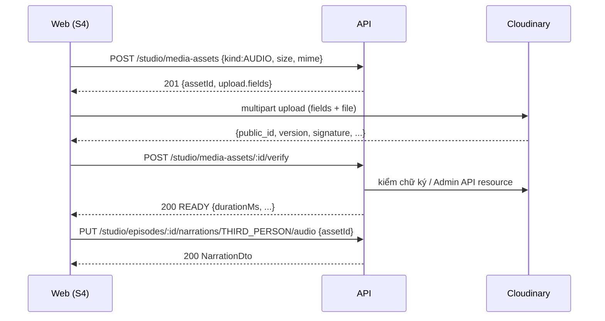
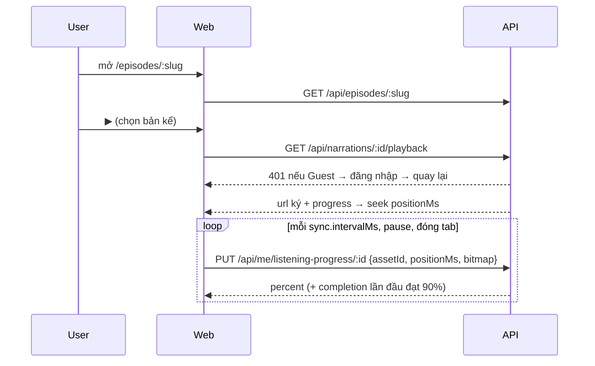

# API contract: Mod tạo podcast + luồng nghe cơ bản

| Mục | Giá trị |
|---|---|
| Ngày | 2026-10-08 |
| Dựa trên | ERD `su-ky-document/schema/schema_261008175553.dbml` (32 bảng), `brainstorm-261008-content-schema-and-moderator-flow.md`, PRD v3.1 |
| Quy ước theo code hiện có | `apps/api/src/app.ts`, `core/middleware/errorHandler.ts`, `modules/script-workflow/presentation/script-workflow.routes.ts` |
| Trạng thái | Nháp, chờ chốt; sau đó đưa vào `/ck:plan` |

Mục lục: [0. Quy ước chung](#0-quy-ước-chung) · [1. Danh mục](#1-danh-mục) · [2. Series](#2-series-moderator) · [3. Tập](#3-tập-moderator) · [4. Bản kể & kịch bản](#4-bản-kể--kịch-bản) · [5. Media](#5-media-cloudinary) · [6. Nguồn & nhân vật trong tập](#6-nguồn--nhân-vật-trong-tập) · [7. AI Studio: phần bổ sung](#7-ai-studio-phần-bổ-sung) · [8. Nghe](#8-luồng-nghe) · [9. Mã lỗi](#9-mã-lỗi) · [10. Cặp ghi/đọc](#10-bảng-cặp-ghi--đọc) · [11. Cần chốt](#11-cần-chốt)

---

## 0. Quy ước chung

**Response: RESTful thuần, không envelope.** HTTP status quyết định thành công hay lỗi; body chỉ là tài nguyên.
```jsonc
// 200 GET /api/studio/series/:id → body là chính Series
{ "id": "uuid", "title": "…", "status": "DRAFT", … }

// 200 GET danh sách → object có items + thông tin trang (không trả mảng trần: còn chỗ thêm field mà không phá client)
{ "items": [ … ], "page": 1, "limit": 20, "total": 57 }

// lỗi → RFC 9457, Content-Type: application/problem+json
{
  "type": "https://su-ky.vn/problems/episode-not-publishable",  // URI theo code; base URL lấy từ config
  "title": "Episode is not publishable",
  "status": 422,
  "detail": "Bản ngôi thứ ba chưa có audio",
  "instance": "/api/studio/episodes/9f1c…/publish",
  "code": "EPISODE_NOT_PUBLISHABLE",                            // extension: client switch theo code, không parse title
  "requestId": "…",
  "checklist": { … }                                             // extension riêng của từng lỗi
}
```
- **Status:** 200 đọc/sửa · 201 tạo (+ header `Location`) · 204 xóa / gỡ / thao tác không có gì trả về · 4xx lỗi client · 5xx lỗi server. 404 khi không có **hoặc không có quyền xem** (không lộ tài nguyên người khác); 403 khi xem được nhưng không được sửa (vd Admin khóa).
- **`requestId`** nằm ở header `X-Request-Id` cho mọi response (middleware `requestId()` đã có); lỗi thì thêm trong body. `timestamp` bỏ: header `Date` đã có.
- **Lỗi validation (400):** extension `errors: [{ "path": "startYear", "message": "…" }]` thay cho `details: err.flatten()`.
- **Quy ước trong tài liệu:** chỗ nào ghi `details.X` (vd `details.current`, `details.checklist`) nghĩa là **extension member `X` ở top-level** của problem body. Chỗ ghi "→ data" nghĩa là body response.
- **Vì sao hợp TanStack Query / Hono RPC:** `queryFn` chỉ cần `if (!res.ok) throw await toProblem(res); return res.json()`; `data` của query chính là tài nguyên, không phải `.data.data`. `hc` của Hono suy kiểu theo status code (`c.json(body, 201)`), nên client nhận union type đúng theo status. `useMutation` `onError` nhận problem có `code` để hiện toast.
- Lỗi nghiệp vụ dùng `code` riêng (mục 9). Cần lớp `DomainError(status, code, detail, extensions)` + `errorHandler` render problem+json.

**Chuyển đổi code hiện có (clean cutover, không giữ 2 kiểu song song)**
- Gỡ envelope ở toàn bộ route đang có: `/api/script-workflows/*` (`meta()` helper, `success: true as const`), `/api/me`, `/api/admin`, `/health` (vẫn 200/503, body là health object), stub `/api/timeline`, `notFound`, `bodyLimit.onError` (413 problem), `errorHandler`.
- Xóa type `ApiResponse<T>` trong `packages/shared`; sửa test `apps/api/tests/{api,auth,script-workflow}.test.ts` theo status + problem body; sửa mục "Response Envelope" trong `apps/api/AGENTS.md`.
- Frontend: sửa chỗ đọc `.data` / `.success` (nếu có) sang đọc thẳng body; thêm 1 helper fetch dùng chung ném `ProblemError`.
- `TransitionResult` nội bộ trong `workflow-command.service.ts` không phải response HTTP → không bắt buộc đổi; route vẫn chuyển nó thành problem.

**Đường dẫn & version**
- Giữ tiền tố `/api` như code hiện có, coi là v1 ngầm. Thay đổi phá vỡ → `/api/v2/...`. (CLAUDE.md yêu cầu versioning cho breaking change; không bắt buộc `/v1` khi chưa có breaking.)
- `/api/studio/*`: CMS cho Moderator/Admin. `/api/*` còn lại: phía người nghe.
- Tên field JSON: camelCase. Enum: UPPER_SNAKE như DB.

**Quyền**
| Nhóm | Middleware | Ghi chú |
|---|---|---|
| `/api/studio/*` | `requireAuth` + role `moderator`/`admin` | Ghi Series/tập: chỉ `series.owner_id` hoặc admin (BR-20). Nội dung `admin_locked_at` → Mod nhận 403 `CONTENT_LOCKED` |
| Duyệt công khai | Không cần đăng nhập | Chỉ trả nội dung hiển thị công khai: tập PUBLISHED + Series PUBLISHED + chưa trong thùng rác (BR-25) |
| Phát audio, tiến trình | `requireAuth` | Guest → 401 `AUTH_REQUIRED` (BR-01) |

**Ghi đè đồng thời (optimistic concurrency)**
- Mọi tài nguyên sửa được trả `updatedAt`. `PATCH`/`PUT` nhận `baseUpdatedAt` (tùy chọn); có mà lệch DB → 409 `STALE_WRITE` kèm bản mới nhất trong `details.current`.
- Lý do: S4 tự lưu, Mod mở 2 tab là chuyện thường. Không thêm cột `version`, dùng `updated_at` có sẵn.

**Idempotency**
- Các thao tác chuyển trạng thái (publish/hide/restore) là idempotent: gọi lại khi đã ở trạng thái đích → 200, không lỗi.
- Nhập AI: idempotent nhờ unique `(script_publication_id, script_publication_episode_no)`.
- Tiến trình nghe: gửi lại cùng bitmap không cộng thêm gì (OR).
- **`Idempotency-Key` bắt buộc** (CLAUDE.md §10) với mọi POST tạo mới/không idempotent tự nhiên:
  - Áp dụng cho: POST `/studio/series`, `/studio/series/:id/episodes`, `/studio/sources`, `/studio/historical-entities`, `/studio/media-assets`, `/studio/episodes/:id/sources`, `/studio/episodes/:id/entity-tags`, `/script-workflows`, `/script-workflows/:id/import`.
  - Không áp dụng: PUT/PATCH/DELETE (tự idempotent; ghi đè có `baseUpdatedAt`), POST chuyển trạng thái (publish/hide/restore/archive/verify), PUT tiến trình nghe (OR bitmap).
  - Header: `Idempotency-Key: <uuid v4>`, client sinh **một lần cho mỗi ý định** (giữ nguyên khi retry vì mạng). Thiếu/sai định dạng → 400 `IDEMPOTENCY_KEY_REQUIRED`.
  - Lưu ở bảng `idempotency_keys` (unique `(user_id, key)`), TTL từ `system_configs`.
  - Xử lý:
    1. Chưa có key → insert `IN_PROGRESS` (+ `request_hash`) rồi chạy handler; xong ghi `response_status` + `response_body` → `COMPLETED`.
    2. Có key, `COMPLETED`, hash khớp → trả lại đúng status + body đã lưu, header `Idempotent-Replayed: true`. Không chạy lại.
    3. Có key, hash khác → 422 `IDEMPOTENCY_KEY_REUSED`.
    4. Có key, `IN_PROGRESS` (request đầu chưa xong) → 409 `IDEMPOTENCY_REQUEST_IN_PROGRESS` + `Retry-After`. Quá lock timeout (config) coi như bỏ dở, cho chạy lại.
    5. Handler trả 5xx **hoặc lỗi retryable** (`SLUG_CONFLICT`, `RATE_LIMITED`, `MEDIA_PROVIDER_UNAVAILABLE`) → xóa dòng, để retry với cùng key được chạy thật. Các 4xx khác lưu `COMPLETED` và replay.
  - Lý do cần dù đã có unique: server tự thêm hậu tố cho slug trùng (bấm 2 lần = 2 Series), còn nguồn/nhân vật/media không có slug.

**Rate limit** (CLAUDE.md §10): mọi route ghi bị giới hạn theo user, route đặc biệt (media-assets, tiến trình nghe, import) có giới hạn riêng; mọi số liệu từ `system_configs`. Vượt → 429 `RATE_LIMITED` + `Retry-After`. Nơi lưu bộ đếm (bảng Postgres hay Redis) chốt trong plan.

**Phân trang**: `?page=1&limit=20`, `limit` tối đa 50 (giống `ListScriptWorkflowsQuerySchema`). Body `{ items, page, limit, total }`. Danh mục nhỏ không phân trang (topics, periods) trả `{ items }` cho đồng dạng.

**Zod contract** đặt ở `packages/shared/src/schemas/content/` và `.../listening/`. Thay thế hẳn các file cũ `schemas/podcast.ts`, `citation.ts`, `figure.ts` (mô hình cũ: `category`, `audioUrl`, `transcript`, `playCount` không khớp ERD).

---

## 1. Danh mục

### 1.1 Topic & giai đoạn (đọc)
| Method | Path | Ai | Mô tả |
|---|---|---|---|
| GET | `/api/topics` | Công khai | Danh sách `is_active`, sắp theo `sort_order` |
| GET | `/api/historical-periods` | Công khai | Như trên, kèm `startYear`, `endYear` để form Series gợi ý khoảng năm |

```jsonc
// GET /api/historical-periods → { items: [ … ] }, mỗi item:
{ "id": "uuid", "slug": "bac-thuoc", "name": "Bắc thuộc", "startYear": -111, "endYear": 938 }
```
CRUD danh mục cho Admin: ngoài phạm vi tài liệu này (đã ghi ở lỗ hổng #8).

### 1.2 Danh mục nguồn
| Method | Path | Mô tả |
|---|---|---|
| GET | `/api/studio/sources?q=&tier=&includeArchived=false&page&limit` | Tìm theo trigram + bỏ dấu trên `title`, `original_title`, `author`; ISBN khớp chính xác. Dùng cho drawer S4, modal Gate 0, bước ghép Gate 2 |
| GET | `/api/studio/sources/:id` | Chi tiết + `usageCount` (số tập đang trích) |
| GET | `/api/studio/sources/similar?title=&author=&isbn=` | Nguồn gần giống (trigram), gọi khi Mod gõ form tạo mới để cảnh báo "có thể trùng". Tách riêng để POST trả đúng SourceDto như GET |
| POST | `/api/studio/sources` | Tạo mới. 201 + `Location` + SourceDto; không chặn khi gần giống |
| PATCH | `/api/studio/sources/:id` | Sửa. Người tạo hoặc admin |
| POST | `/api/studio/sources/:id/archive` · `/unarchive` | Ẩn khỏi tìm kiếm (`archived_at`). Không có DELETE: `episode_sources` restrict |

```jsonc
// POST /api/studio/sources
{
  "tier": "TIER_1_CHINH_SU",           // bắt buộc
  "title": "Đại Việt sử ký toàn thư",  // 1..500
  "originalTitle": "大越史記全書",       // tùy chọn
  "author": "Ngô Sĩ Liên",
  "translator": "Viện KHXH",
  "publisher": "NXB KHXH",
  "publicationYear": 1993,             // số nguyên, có thể âm
  "edition": "Tái bản lần 2",
  "isbn": "9786049...",                // chuẩn hóa bỏ gạch; trùng → 409 SOURCE_ISBN_TAKEN + details.existingId
  "url": "https://...",                // http/https
  "accessedAt": null                    // nếu chốt thêm cột (research §4)
}
```

### 1.3 Nhân vật & sự kiện
| Method | Path | Mô tả |
|---|---|---|
| GET | `/api/studio/historical-entities?q=&type=FIGURE|EVENT&page&limit` | Tìm theo `name` + `aliases` |
| GET | `/api/studio/historical-entities/:id` | Chi tiết |
| GET | `/api/studio/historical-entities/similar?name=&type=` | Như nguồn |
| POST | `/api/studio/historical-entities` | `{ entityType, name, aliases[], startYear?, endYear?, summary? }` → 201 EntityDto |
| PATCH | `/api/studio/historical-entities/:id` | Sửa |

---

## 2. Series (Moderator)

| Method | Path | Mô tả | Màn |
|---|---|---|---|
| GET | `/api/studio/series?status=DRAFT|PUBLISHED|HIDDEN|TRASH&q=&page&limit` | Series của tôi (admin: tất cả, thêm `ownerId=`) | S1 |
| POST | `/api/studio/series` | Tạo nháp | S2 |
| GET | `/api/studio/series/:id` | Chi tiết + danh sách tập + checklist publish + run AI đang chờ | S3 |
| PATCH | `/api/studio/series/:id` | Sửa thông tin | S2/S3 |
| POST | `/api/studio/series/:id/publish` | Kiểm tra BR-40/41 rồi publish | S3 |
| POST | `/api/studio/series/:id/hide` | PUBLISHED → HIDDEN | S1/S3 |
| DELETE | `/api/studio/series/:id` | Vào thùng rác (`deleted_at`, lưu `status_before_delete`) | S1 |
| POST | `/api/studio/series/:id/restore` | Khôi phục về `status_before_delete` | S1 |
| PUT | `/api/studio/series/:id/episode-order` | Đổi thứ tự tập | S3 |

**POST / PATCH body**
```jsonc
{
  "title": "Khởi nghĩa Hai Bà Trưng",  // POST bắt buộc, 1..200
  "slug": "khoi-nghia-hai-ba-trung",   // tùy chọn, chỉ khi DRAFT; không gửi → server sinh từ title (bỏ dấu)
  "description": "…",                  // ≤ 5000
  "topicId": "uuid|null",
  "historicalPeriodId": "uuid|null",
  "startYear": 40, "endYear": 43,       // số âm = TCN, không có 0; start ≤ end ≤ 1945
  "coverImageAssetId": "uuid|null",     // asset IMAGE, READY, do chính user upload
  "baseUpdatedAt": "…"                   // chỉ PATCH
}
```
- **Quy tắc slug (dùng chung Series và tập):**
  - Chuẩn hóa: bỏ dấu, `đ→d`, chữ thường, chỉ `[a-z0-9-]`, gộp `-`, cắt độ dài tối đa (config) **trước khi** nối hậu tố.
  - Trùng (kể cả bản trong thùng rác) → nối `-` + 4 ký tự ngẫu nhiên `[a-z0-9]` (vd `khoi-nghia-hai-ba-trung-k3x9`). Áp cho cả slug server sinh lẫn slug Mod gõ; không trả `SLUG_TAKEN`, response trả slug thật để UI hiện.
  - Đảm bảo bằng unique index, không SELECT trước (2 request đồng thời cùng thấy "chưa trùng"). Insert bằng `INSERT … ON CONFLICT (slug) DO NOTHING RETURNING id` (Prisma `$queryRaw` trong `$transaction`): không có dòng trả về → sinh hậu tố mới, lặp tối đa N lần (config). Không dùng cách bắt lỗi 23505/P2002: trong Postgres lỗi đó làm hỏng cả transaction (đi chung idempotency key, audit, import) nên lần thử lại cũng chết. Hết N lần → 409 `SLUG_CONFLICT` (retryable). 36⁴ ≈ 1,7 triệu nên thực tế gần như không phải lặp.
  - Chỉ sửa được khi DRAFT; PATCH slug lúc PUBLISHED/HIDDEN → 409 `SLUG_LOCKED`. Không cần bảng redirect.
- Đổi `coverImageAssetId`: ghi `detached_at` cho ảnh cũ trong cùng transaction.

**GET /api/studio/series/:id → data**
```jsonc
{
  "id": "uuid", "title": "…", "slug": "…", "description": "…",
  "status": "DRAFT", "isDeleted": false,
  "lock": null,                                // { "lockedAt": "…", "lockedBy": { "id", "name" } } khi Admin khóa
  "topic": { "id", "name" }, "historicalPeriod": { "id", "name" },
  "startYear": 40, "endYear": 43,
  "cover": { "assetId": "uuid", "url": "https://res.cloudinary.com/…" },
  "owner": { "id", "name" },
  "publishedAt": null, "updatedAt": "…",
  "publishChecklist": {                         // cùng logic với POST publish, để nút bị khóa có lý do
    "ready": false,
    "items": [
      { "key": "TOPIC", "ok": false },
      { "key": "HISTORICAL_PERIOD", "ok": false },
      { "key": "YEAR_RANGE", "ok": true },
      { "key": "HAS_PUBLISHED_EPISODE", "ok": false }
    ]
  },
  "episodes": [
    {
      "id": "uuid", "title": "…", "slug": "…", "sortOrder": 1, "status": "DRAFT",
      "progress": { "hasSource": true, "hasThirdPersonScript": true, "hasThirdPersonAudio": false, "isPublished": false }
    }
  ],
  "pendingAiRuns": [                            // workflow_runs.series_id = Series này, chưa nhập
    { "runId": "uuid", "status": "AWAITING_APPROVAL", "awaitingStep": "STORY_PLANNER", "createdAt": "…" }
  ]
}
```
Danh sách S1 trả bản rút gọn: `id, title, slug, status, isDeleted, lock, cover, startYear, endYear, episodeCounts { published, total }, updatedAt`.

**POST /publish**
- Thiếu điều kiện → 422 `SERIES_NOT_PUBLISHABLE`, `details.checklist` giống `publishChecklist`.
- Series PUBLISHED thì người nghe thấy các tập PUBLISHED bên trong; tập DRAFT vẫn ẩn.

**DELETE (thùng rác)**
- Không xóa cứng. Tập bên trong không đổi trạng thái; công khai bị ẩn vì Series cha đã vào thùng rác (BR-25).
- Restore Series không tự restore tập đã bị xóa riêng.

**PUT /episode-order**
```jsonc
{ "episodeIds": ["uuid3", "uuid1", "uuid2"], "baseUpdatedAt": "…" }
```
- Phải là **đúng tập hợp** tập chưa xóa của Series → khác thì 422 `EPISODE_ORDER_MISMATCH` (chống ghi đè khi có tập vừa được thêm ở tab khác). Ghi `sort_order` trong 1 transaction (BR-43 vế 1). Trả lại danh sách tập.

---

## 3. Tập (Moderator)

| Method | Path | Mô tả | Màn |
|---|---|---|---|
| POST | `/api/studio/series/:seriesId/episodes` | Tạo tập nháp `{ title, slug? }`; `sort_order` = cuối danh sách | S3 |
| GET | `/api/studio/episodes/:id` | Toàn bộ workspace S4 | S4 |
| PATCH | `/api/studio/episodes/:id` | `{ title?, slug?, description?, baseUpdatedAt? }` | S4 tab Thông tin |
| POST | `/api/studio/episodes/:id/publish` | Kiểm BR-40 | S4 tab Xuất bản |
| POST | `/api/studio/episodes/:id/hide` | PUBLISHED → HIDDEN | S4 |
| DELETE | `/api/studio/episodes/:id` | Vào thùng rác | S3/S4 |
| POST | `/api/studio/episodes/:id/restore` | Khôi phục. Series cha đang trong thùng rác → 409 `PARENT_IN_TRASH` | Thùng rác |

**GET /api/studio/episodes/:id → data**
```jsonc
{
  "id": "uuid", "seriesId": "uuid", "seriesTitle": "…", "seriesStatus": "DRAFT",
  "title": "…", "slug": "…", "description": "…", "sortOrder": 2,
  "status": "DRAFT", "isDeleted": false, "lock": null, "publishedAt": null, "updatedAt": "…",
  "narrations": [ /* NarrationDto, mục 4 */ ],
  "sources": [ /* EpisodeSourceDto, mục 6 */ ],
  "entityTags": [ /* EntityTagDto, mục 6 */ ],
  "publishChecklist": {
    "ready": false,
    "items": [
      { "key": "BASIC_INFO", "ok": true },
      { "key": "HAS_SOURCE", "ok": true },
      { "key": "THIRD_PERSON_SCRIPT", "ok": true },
      { "key": "THIRD_PERSON_AUDIO", "ok": false }
    ],
    "warnings": [ { "key": "SERIES_NOT_PUBLISHED" }, { "key": "ENTITY_TAGS_UNCONFIRMED", "count": 4 } ]
  }
}
```
- `warnings` không chặn publish (metadata gợi ý, Series nháp).
- POST publish khi checklist chưa đạt → 422 `EPISODE_NOT_PUBLISHABLE` + `details.checklist`.

---

## 4. Bản kể & kịch bản

`:type` ∈ `THIRD_PERSON | FIRST_PERSON`. Mỗi tập tối đa 1 bản mỗi loại (unique `(episode_id, narration_type)`).

| Method | Path | Mô tả |
|---|---|---|
| GET | `/api/studio/episodes/:id/narrations/:type` | Một bản kể (đầy đủ script) |
| PUT | `/api/studio/episodes/:id/narrations/:type` | Tạo hoặc sửa: `{ scriptContent?, narratorEntityId?, baseUpdatedAt? }` |
| DELETE | `/api/studio/episodes/:id/narrations/FIRST_PERSON` | Gỡ bản ngôi thứ nhất. THIRD_PERSON không xóa được (luôn tồn tại); tập đã publish thì cũng không gỡ được audio của nó (409 `REQUIRED_FOR_PUBLISHED`) |
| GET | `/api/studio/episodes/:id/narrations/:type/ai-original` | Bản AI gốc từ `script_publications` (chỉ khi có `script_publication_id`); 404 nếu viết tay |
| PUT | `/api/studio/episodes/:id/narrations/:type/audio` | Gắn/thay audio |
| DELETE | `/api/studio/episodes/:id/narrations/:type/audio` | Gỡ audio (ghi `detached_at`) |

**NarrationDto**
```jsonc
{
  "id": "uuid", "type": "THIRD_PERSON",
  "narrator": null,                           // FIRST_PERSON: { "id", "name" } (historical_entities FIGURE)
  "scriptContent": "…",                       // danh sách tập trong GET episode trả scriptPreview (≤ 300 ký tự) thay vì full
  "wordCount": 2450, "estimatedDurationMs": 960000,   // ước tính theo tốc độ đọc trong system_configs
  "origin": { "kind": "AI", "scriptPublicationId": "uuid", "episodeNo": 2, "editedAfterImport": true }, // hoặc { "kind": "MANUAL" }
  "audio": {                                  // null nếu chưa có
    "assetId": "uuid", "provider": "ELEVENLABS",
    "durationMs": 1012000, "sizeBytes": 9437184, "format": "mp3",
    "previewUrl": "https://…signed…",         // để Mod nghe thử trong S4
    "attachedAt": "…"
  },
  "warnings": [
    { "key": "SCRIPT_CHANGED_AFTER_AUDIO" },                       // updated script sau khi gắn audio
    { "key": "DURATION_MISMATCH", "ratio": 1.35 }                   // lệch > ngưỡng trong system_configs
  ],
  "updatedAt": "…"
}
```
- `editedAfterImport` = `script_content` khác bản trong publication (so hash khi đọc, không lưu cột).
- `narratorEntityId` chỉ nhận khi `:type = FIRST_PERSON`, entity phải là FIGURE → sai thì 422.

**PUT …/audio**
```jsonc
{ "assetId": "uuid", "provider": "UPLOAD|ELEVENLABS", "confirmReplacePublished": false }
```
- Asset phải `kind = AUDIO`, `status = READY`, `uploaded_by_id` = user (hoặc admin); asset đang gắn chỗ khác → 409 `ASSET_IN_USE` (unique).
- Tập đang PUBLISHED và đã có audio, mà `confirmReplacePublished = false` → 409 `REPLACE_CONFIRMATION_REQUIRED` (UI mở hộp xác nhận, BR-43 vế 2).
- Trong 1 transaction: trỏ FK sang asset mới, ghi `detached_at` cho asset cũ, xóa `detached_at` của asset mới, audit `narration.audio_replaced`.
- Trả NarrationDto.

---

## 5. Media (Cloudinary)

| Method | Path | Mô tả |
|---|---|---|
| POST | `/api/studio/media-assets` | Xin upload: tạo dòng `PENDING` + trả chữ ký |
| GET | `/api/studio/media-assets/:id` | Trạng thái + metadata (+ `previewUrl` khi READY) |
| POST | `/api/studio/media-assets/:id/verify` | Xác minh sau khi upload → READY |

**POST /api/studio/media-assets**
```jsonc
// request
{ "kind": "AUDIO", "fileName": "tap-2.mp3", "sizeBytes": 9437184, "mimeType": "audio/mpeg" }
// 201 data
{
  "assetId": "uuid",
  "upload": {
    "url": "https://api.cloudinary.com/v1_1/<cloud>/video/upload",
    "fields": {                           // client gửi multipart y nguyên + file
      "api_key": "…", "timestamp": 1760000000, "signature": "…",
      "public_id": "audio/<uuid>", "type": "authenticated", "resource_type": "video"
    }
  },
  "expiresAt": "…"                        // chữ ký Cloudinary có hiệu lực giới hạn; quá → xin lại
}
```
- Kiểm tra trước khi ký: `mimeType` thuộc danh sách cho phép, `sizeBytes` ≤ giới hạn — đều từ `system_configs`. Vi phạm → 422 `MEDIA_TYPE_NOT_ALLOWED` / `MEDIA_TOO_LARGE`. Đây chỉ là chặn sớm; con số thật lấy ở bước verify.
- Không có "mục đích" trong request: asset chỉ gắn vào nơi dùng qua PUT audio / PATCH cover. Asset không ai gắn sẽ bị job dọn.
- Rate limit theo user (giá trị trong config) để không bị dùng làm kho file miễn phí.

**POST /:id/verify**
```jsonc
// request: phần response Cloudinary trả về trình duyệt
{ "publicId": "audio/<uuid>", "version": 1760000123, "signature": "…" }
// 200 data
{ "assetId": "uuid", "status": "READY", "kind": "AUDIO", "format": "mp3",
  "sizeBytes": 9437184, "durationMs": 1012000, "previewUrl": "https://…signed…" }
```
- Server kiểm `publicId` khớp dòng, kiểm chữ ký response (hoặc gọi Admin API), lấy `duration/bytes/format` **từ Cloudinary**, rồi so lại giới hạn dung lượng.
- Lỗi:
  - Không tìm thấy file trên Cloudinary → 409 `MEDIA_NOT_UPLOADED` (client upload lại).
  - Chữ ký sai → 422 `MEDIA_SIGNATURE_INVALID`.
  - Audio không đọc được thời lượng hoặc vượt giới hạn → 422 `MEDIA_INVALID` + xóa file trên Cloudinary + `DELETED`.
  - Cloudinary lỗi/timeout → 503 `MEDIA_PROVIDER_UNAVAILABLE` (retryable; dòng vẫn PENDING).
- Gọi lại khi đã READY → 200 trả như cũ (idempotent).

**GET /:id**: `{ assetId, kind, status, format, sizeBytes, durationMs, createdAt, verifiedAt, previewUrl? }`. Dùng khi client mất kết nối giữa chừng và cần biết asset đã READY chưa.

**Luồng upload audio trong S4**


---

## 6. Nguồn & nhân vật trong tập

| Method | Path | Mô tả |
|---|---|---|
| GET | `/api/studio/episodes/:id/sources` | Danh sách trích dẫn (cũng có sẵn trong GET episode) |
| POST | `/api/studio/episodes/:id/sources` | `{ sourceId, locator?, excerpt? }` → nối cuối. Trùng `(sourceId, locator)` → 409 `EPISODE_SOURCE_DUPLICATE` |
| PATCH | `/api/studio/episodes/:id/sources/:episodeSourceId` | `{ locator?, excerpt? }` |
| DELETE | `/api/studio/episodes/:id/sources/:episodeSourceId` | Gỡ trích dẫn (không xóa nguồn trong danh mục). Tập đã publish mà đây là nguồn cuối → 409 `REQUIRED_FOR_PUBLISHED` |
| PUT | `/api/studio/episodes/:id/sources/order` | `{ episodeSourceIds[] }`, đúng tập hợp như episode-order |
| GET | `/api/studio/episodes/:id/entity-tags` | Danh sách thẻ |
| POST | `/api/studio/episodes/:id/entity-tags` | `{ entityId }` → CONFIRMED, origin MODERATOR |
| PATCH | `/api/studio/episodes/:id/entity-tags/:tagId` | `{ status: "CONFIRMED" | "REJECTED" }` |
| DELETE | `/api/studio/episodes/:id/entity-tags/:tagId` | Gỡ thẻ |

- "Hoàn tác" 5 giây ở UI = gọi lại POST với cùng dữ liệu; không cần endpoint riêng.

```jsonc
// EpisodeSourceDto
{ "id": "uuid", "sortOrder": 1, "locator": "Bản kỷ, quyển 3", "excerpt": "…", "origin": "AI",
  "source": { "id": "uuid", "tier": "TIER_1_CHINH_SU", "title": "…", "author": "…", "publicationYear": 1993, "url": null } }
// EntityTagDto
{ "id": "uuid", "status": "SUGGESTED", "origin": "AI",
  "entity": { "id": "uuid", "entityType": "FIGURE", "name": "Trưng Trắc" } }
```

---

## 7. AI Studio: phần bổ sung

Chỉ liệt kê thay đổi so với `/api/script-workflows` đang có (tạo run, chi tiết, cây, hành động Gate, SSE giữ nguyên).

| Method | Path | Thay đổi |
|---|---|---|
| POST | `/api/script-workflows` | Body thêm `seriesId?` (Series đích, phải thuộc quyền user) và `focusHint?` (đang bỏ qua ở `step-prompt.mapper.ts:71-75`, cần nối vào) |
| GET | `/api/script-workflows?seriesId=` | Thêm filter để S3 hiện run đang chờ |
| GET | `/api/script-workflows/:id/import-preview` | Dữ liệu cho tab Rà nguồn / Nhân vật ở Gate 2 |
| POST | `/api/script-workflows/:id/import` | **Duyệt Gate 2 + nhập vào CMS** |
| GET | `/api/script-workflows/:id/import` | Kết quả nhập (404 `NOT_IMPORTED` nếu chưa) |

**SourceItem trong output RESEARCHER**: thêm `catalogSourceId?: string` (sửa `SourceItemSchema` ở `packages/shared`). Modal Gate 0 gán khi Mod chọn nguồn từ danh mục.

**GET /import-preview** (chỉ khi FACT_CHECKER đang chờ duyệt hoặc run đã xong mà chưa nhập)
```jsonc
{
  "target": { "kind": "NEW_SERIES", "seriesTitle": "…" },   // hoặc { "kind": "EXISTING_SERIES", "seriesId", "seriesTitle", "nextSortOrder": 4 }
  "factCheck": { "passed": false, "issueCount": 3 },
  "basis": { "factCheckerVersionId": "uuid" },               // nhánh đang xem; gửi lại khi import
  "episodes": [ { "episodeNo": 1, "title": "…", "wordCount": 2400 } ],
  "sources": [
    {
      "itemId": "src-3",                 // id trong sourcesCatalogue
      "item": { "title": "…", "author": "…", "tier": "TIER_2_KHAO_CO", "locationInSource": "…" },
      "origin": "AI",                    // custom-src-* → MODERATOR
      "catalogSourceId": null,           // đã gán ở Gate 0 thì có, khi đó không cần quyết định
      "candidates": [ { "sourceId": "uuid", "title": "…", "similarity": 0.82 } ]
    }
  ],
  "entities": [
    { "itemKey": "Trưng Trắc", "entityType": "FIGURE", "candidates": [ { "entityId": "uuid", "name": "Trưng Trắc", "similarity": 1 } ] }
  ]
}
```

**POST /import**
```jsonc
{
  "basis": { "factCheckerVersionId": "uuid" },
  "approvalNote": "…",
  "sourceDecisions": [
    { "itemId": "src-3", "action": "USE_EXISTING", "sourceId": "uuid" },
    { "itemId": "src-4", "action": "CREATE" },          // tạo từ dữ liệu item, có thể kèm "overrides": { "title": "…" }
    { "itemId": "src-7", "action": "DROP" }
  ],
  "entityDecisions": [
    { "itemKey": "Trưng Trắc", "action": "USE_EXISTING", "entityId": "uuid", "confirm": true },
    { "itemKey": "Thi Sách", "action": "CREATE", "confirm": false }   // confirm=false → tag SUGGESTED
  ]
}
```
- `sourceDecisions` phải phủ **mọi** nguồn chưa có `catalogSourceId` → thiếu: 422 `IMPORT_DECISIONS_INCOMPLETE` + `details.missingItemIds`. `entityDecisions` thiếu → bỏ qua entity đó.
- `basis.factCheckerVersionId` khác nhánh hiện tại → 409 `STALE_WRITE` (cùng cơ chế baseVersion của Gate).
- Một transaction: CONTINUE ở Gate FACT_CHECKER → tạo `script_publications` (logic `publication.service` hiện có) → tạo/ghép Series, tập, bản kể THIRD_PERSON, nguồn, thẻ → `workflow_runs.series_id` → audit `ai_import`. Lỗi bất kỳ → hủy hết.
- Nếu run đã COMPLETED (publication có sẵn, chưa nhập) → bỏ bước CONTINUE, chỉ nhập.
- Gọi lại khi đã nhập → 200 trả kết quả cũ, không tạo thêm.
- Kết quả (cũng là `data` của GET /import):
```jsonc
{ "seriesId": "uuid", "createdSeries": true,
  "episodes": [ { "episodeNo": 1, "episodeId": "uuid", "narrationId": "uuid", "title": "…" } ],
  "createdSourceIds": ["uuid"], "createdEntityIds": ["uuid"], "importedAt": "…" }
```

---

## 8. Luồng nghe

### 8.1 Duyệt công khai (Guest được)
| Method | Path | Mô tả |
|---|---|---|
| GET | `/api/series?topicId=&historicalPeriodId=&fromYear=&toYear=&q=&page&limit` | Series hiển thị công khai. Lọc năm theo giao khoảng (BR-15) |
| GET | `/api/series/:slug` | Chi tiết + tập công khai theo `sort_order`; đăng nhập thì kèm tiến độ |
| GET | `/api/episodes/:slug` | Trang tập (L1) |

Nội dung không công khai (nháp, ẩn, thùng rác, Series cha không công khai) → 404, kể cả với Mod (Mod xem trước qua `/api/studio`).

**GET /api/episodes/:slug → data**
```jsonc
{
  "id": "uuid", "slug": "…", "title": "…", "description": "…", "publishedAt": "…",
  "series": { "id": "uuid", "slug": "…", "title": "…", "startYear": 40, "endYear": 43, "cover": { "url": "…" } },
  "narrations": [
    { "id": "uuid", "type": "THIRD_PERSON", "narrator": null, "durationMs": 1012000, "available": true },
    { "id": "uuid", "type": "FIRST_PERSON", "narrator": { "id", "name": "Trưng Trắc" }, "durationMs": 980000, "available": true }
  ],
  "sources": [ { "title": "…", "author": "…", "tier": "TIER_1_CHINH_SU", "locator": "…", "url": null } ],
  "entities": [ { "id": "uuid", "entityType": "FIGURE", "name": "…" } ],   // chỉ CONFIRMED
  "previousEpisode": { "slug": "…", "title": "…" }, "nextEpisode": { "slug": "…", "title": "…" },
  "hasQuiz": true,
  "viewer": null   // Guest. Đăng nhập: { "isCompleted": true, "progress": [ { "narrationId", "positionMs", "percent", "completedAt" } ] }
}
```
- Bản kể có `available: false` khi chưa có audio (ngôi thứ nhất chưa xong); UI không cho chọn.
- Trả `durationMs` cho Guest để hiện thời lượng; **không** trả URL audio.

### 8.2 Phát audio (cần đăng nhập)
| Method | Path | Mô tả |
|---|---|---|
| GET | `/api/narrations/:narrationId/playback` | URL ký + tiến trình để resume |

```jsonc
// 200 data
{
  "narrationId": "uuid", "episodeId": "uuid",
  "audio": { "assetId": "uuid", "url": "https://res.cloudinary.com/…/authenticated/s--sig--/v1760000123/audio/<uuid>.mp3",
             "mimeType": "audio/mpeg", "durationMs": 1012000 },
  "progress": {                         // null nếu chưa nghe lần nào
    "assetId": "uuid", "positionMs": 431000, "playedBitmap": "base64…",
    "playedSeconds": 420, "percent": 41.5, "completedAt": null
  },
  "sync": { "intervalMs": 15000, "completionThreshold": 0.9 }   // từ system_configs
}
```
- Guest → 401 `AUTH_REQUIRED`. UI chuyển tới đăng nhập với `returnTo=/episodes/:slug` (G-07); quay lại thì hiện nút "▶ Nghe ngay", không tự phát.
- `progress.assetId` khác `audio.assetId` (Mod đã thay audio) → server trả `progress` đã reset `positionMs = 0`, bitmap rỗng, **giữ `completedAt`**; DB được reset ở lần PUT kế tiếp.
- URL không hết hạn (gói Free); chặn Guest là ở endpoint này.
- Header `Cache-Control: private, no-store`.

### 8.3 Tiến trình nghe
| Method | Path | Mô tả |
|---|---|---|
| GET | `/api/me/listening-progress/:narrationId` | Tiến trình của 1 bản kể (dùng khi đổi bản kể / mở lại tab) |
| PUT | `/api/me/listening-progress/:narrationId` | Gửi tiến trình định kỳ, khi pause, khi đóng tab (`keepalive`) |
| GET | `/api/me/listening-history?status=all|in_progress|completed&page&limit` | Lịch sử (U-04) + "Đang nghe dở" ở trang chủ |

**PUT body**
```jsonc
{
  "assetId": "uuid",                  // asset client đang phát
  "positionMs": 445000,               // ≤ durationMs
  "playedBitmap": "base64…"           // toàn bộ bitmap, không phải phần chênh lệch
}
```
Server xử lý trong 1 transaction:
1. Narration phải còn hiển thị công khai → không thì 404 `CONTENT_UNAVAILABLE` (UI dừng phát, toast "Tập không còn khả dụng").
2. `assetId` khác audio hiện tại → 409 `AUDIO_CHANGED` + `details.current` (assetId, url, durationMs). Client tải lại player từ đầu. Bitmap/position của file cũ không được ghi.
3. Cắt bitmap theo `ceil(durationMs/1000)` bit; quá dài → 422 `PROGRESS_INVALID`.
4. Chống gửi giả: số bit mới ≤ `(now - last_listened_at)` × hệ số tốc độ tối đa + dung sai (config). Lần đầu: ≤ `sync.intervalMs` × hệ số. Vượt → chỉ nhận phần trong giới hạn (không lỗi, tránh phạt người dùng thật khi lệch giờ), log cảnh báo kèm requestId + userId.
5. OR bitmap; cập nhật `played_seconds`, `position_ms` (bản mới nhất thắng, Q-08), `last_listened_at`.
6. Lần đầu đạt ngưỡng → `completed_at` + `xp_awards(LISTEN, episodeId)` (unique, nên cả 2 bản kể chỉ được 20 XP một lần) + cộng `users.total_xp` + cập nhật nhiệm vụ tuần đang mở.

```jsonc
// 200 data
{
  "narrationId": "uuid", "positionMs": 445000, "playedSeconds": 905, "percent": 89.4,
  "completedAt": "…|null",
  "completion": null   // chỉ lần vừa hoàn thành: { "xpAwarded": 20, "totalXp": 340, "missions": [ { "id", "title", "progress": 3, "target": 3, "completedNow": true, "xpAwarded": 30 } ] }
}
```
- `completion` chỉ có ở đúng response vừa hoàn thành → UI hiện thẻ L3. Gửi lại sau đó → `completion: null`, không cộng thêm.
- Rate limit: tối đa N request/phút/user (config) để tránh spam.

**GET /api/me/listening-history → `{ items, page, limit, total }`**, mỗi item (1 dòng/tập, gộp các bản kể):
```jsonc
{ "episode": { "id", "slug", "title", "series": { "slug", "title" } },
  "lastListenedAt": "…", "lastNarrationId": "uuid", "lastPositionMs": 445000,
  "percent": 89.4,          // cao nhất trong các bản kể
  "isCompleted": false }
```
Tập đã bị ẩn/xóa vẫn giữ trong lịch sử nhưng `episode.available: false`, không có nút tiếp tục.



---

## 9. Mã lỗi
| Code | HTTP | Khi nào | Retry? |
|---|---|---|---|
| `VALIDATION_ERROR` | 400 | Zod (có sẵn) | Không |
| `AUTH_REQUIRED` | 401 | Guest phát audio / gọi `/api/me` | Sau đăng nhập |
| `FORBIDDEN` | 403 | Không đủ role / không phải owner nhưng xem được | Không |
| `CONTENT_LOCKED` | 403 | Admin khóa (BR-42) | Không |
| `NOT_FOUND` | 404 | Không có hoặc không được xem | Không |
| `CONTENT_UNAVAILABLE` | 404 | Nội dung vừa bị ẩn/xóa khi đang nghe | Không |
| `NOT_IMPORTED` | 404 | GET import khi chưa nhập | Không |
| `STALE_WRITE` | 409 | `baseUpdatedAt` / `basis` lệch | Tải lại rồi làm lại |
| `SOURCE_ISBN_TAKEN`, `EPISODE_SOURCE_DUPLICATE` | 409 | Trùng unique | Không |
| `SLUG_LOCKED` | 409 | Sửa slug khi nội dung không còn DRAFT | Không |
| `SLUG_CONFLICT` | 409 | Hết số lần thử hậu tố slug | Có, giữ nguyên `Idempotency-Key` |
| `ASSET_IN_USE` | 409 | Asset đã gắn chỗ khác | Không |
| `REPLACE_CONFIRMATION_REQUIRED` | 409 | Thay audio tập đã publish chưa xác nhận | Gửi lại với confirm |
| `REQUIRED_FOR_PUBLISHED` | 409 | Gỡ thứ BR-40 bắt buộc khỏi tập đã publish | Không |
| `PARENT_IN_TRASH` | 409 | Restore tập khi Series trong thùng rác | Không |
| `AUDIO_CHANGED` | 409 | Tiến trình gửi cho asset cũ | Tải lại player |
| `MEDIA_NOT_UPLOADED` | 409 | Verify khi file chưa có trên Cloudinary | Upload lại |
| `SERIES_NOT_PUBLISHABLE`, `EPISODE_NOT_PUBLISHABLE` | 422 | Checklist chưa đạt | Không |
| `EPISODE_ORDER_MISMATCH` | 422 | Danh sách thứ tự không khớp | Tải lại |
| `IMPORT_DECISIONS_INCOMPLETE` | 422 | Thiếu quyết định nguồn | Không |
| `MEDIA_TYPE_NOT_ALLOWED`, `MEDIA_TOO_LARGE`, `MEDIA_INVALID`, `MEDIA_SIGNATURE_INVALID` | 422 | File không hợp lệ | Không |
| `PROGRESS_INVALID` | 422 | Bitmap/position sai kích thước | Không |
| `IDEMPOTENCY_KEY_REQUIRED` | 400 | POST bắt buộc thiếu/sai `Idempotency-Key` | Gửi lại có key |
| `IDEMPOTENCY_REQUEST_IN_PROGRESS` | 409 | Request đầu cùng key chưa xong | Có, theo `Retry-After`, giữ nguyên key |
| `IDEMPOTENCY_KEY_REUSED` | 422 | Cùng key nhưng body/route khác | Không; sinh key mới |
| `RATE_LIMITED` | 429 | Vượt giới hạn | Có, theo `Retry-After` |
| `MEDIA_PROVIDER_UNAVAILABLE` | 503 | Cloudinary lỗi/timeout | Có |

---

## 10. Bảng cặp ghi ↔ đọc
Mỗi thao tác ghi có endpoint đọc lại đúng thứ vừa ghi. POST tạo → 201 + `Location` + DTO giống GET; PATCH/PUT và POST chuyển trạng thái → 200 + DTO mới (client `setQueryData` thẳng, khỏi refetch); DELETE/gỡ → 204 (client `invalidateQueries`). Ngoại lệ có chủ đích: `PUT` tiến trình nghe trả kèm `completion`. Route `/similar` phải khai báo trước `/:id` trong Hono.

| Ghi | Đọc lại | DTO chung |
|---|---|---|
| POST/PATCH `/studio/sources` | GET `/studio/sources/:id`, GET `/studio/sources?q=` | SourceDto |
| POST/PATCH `/studio/historical-entities` | GET `/studio/historical-entities/:id` | EntityDto |
| POST/PATCH/DELETE/restore/publish/hide `/studio/series/:id` | GET `/studio/series/:id`, GET `/studio/series` | SeriesDetailDto / SeriesListItemDto |
| PUT `/studio/series/:id/episode-order` | GET `/studio/series/:id` (`episodes[]`) | EpisodeListItemDto[] |
| POST/PATCH/DELETE/restore/publish/hide episodes | GET `/studio/episodes/:id` | EpisodeWorkspaceDto |
| PUT/DELETE narrations, PUT/DELETE audio | GET `/studio/episodes/:id/narrations/:type` | NarrationDto |
| POST `/studio/media-assets`, POST `/:id/verify` | GET `/studio/media-assets/:id` | MediaAssetDto |
| POST/PATCH/DELETE episode sources, PUT order | GET `/studio/episodes/:id/sources` | EpisodeSourceDto[] |
| POST/PATCH/DELETE entity tags | GET `/studio/episodes/:id/entity-tags` | EntityTagDto[] |
| POST `/script-workflows/:id/import` | GET `/script-workflows/:id/import` | ImportResultDto |
| PUT `/me/listening-progress/:id` | GET `/me/listening-progress/:id`, GET `/narrations/:id/playback`, GET `/me/listening-history` | ListeningProgressDto |

Phía người nghe: publish ở studio → hiện ở `GET /api/series`, `/api/series/:slug`, `/api/episodes/:slug`.

---

## 11. Cần chốt
Tất cả đã chốt 261008 theo hướng ponytail:
1. **Quiz không khóa** tới khi nghe xong (thứ tự là gợi ý UX, không phải luật). `viewer` không có `quizUnlocked`; XP Quiz vẫn chống cộng trùng bằng unique.
2. Slug chỉ sửa khi DRAFT; trùng → nối 4 ký tự ngẫu nhiên (§2).
3. `Idempotency-Key` bắt buộc (§0, CLAUDE.md §10).
4. Không có tải file kịch bản; chỉ nút Sao chép ở client.
5. Mặc định `system_configs`: sync 15 giây, tốc độ tối đa 2x, dung sai 1 chu kỳ. Không buffer `localStorage` khi mất mạng (bitmap đầy đủ ở lần gửi kế tiếp).
6. **Không mini-player:** player nằm trong trang tập; chuyển trang thì dừng, quay lại resume từ `positionMs`. Media Session vẫn dùng trong trang. Contract không đổi nếu sau này thêm.
