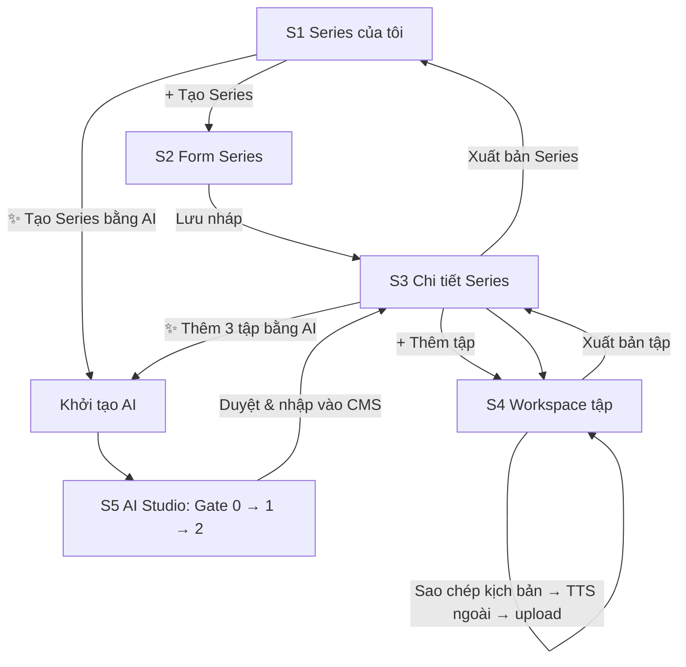

# Brainstorm 261008: Schema dữ liệu nền + luồng Moderator tạo podcast

| Mục | Giá trị |
|---|---|
| Baseline yêu cầu | `su-ky-document/brainstorm/Su-Ky-PRD-v3.1.docx` (04/10/2026) |
| ERD chốt | `su-ky-document/schema/schema_261008175553.dbml`: 32 bảng, parse sạch bằng `@dbml/core` |
| ERD cũ (tham khảo) | `su-ky-document/schema/schema_261004031458.dbml` / `.sql` |
| AI workflow tham chiếu | `test-pi-agent-2/docs/fe-moderator-flow-handoff.md`, `docs/fe-moderator-api-reference.md`, `plans/2026-10-03-interactive-curation-modals/` |
| Trạng thái | Đã thống nhất, chờ `/ck:plan` |

---

## 1. Vấn đề & yêu cầu

- Cần schema cho dữ liệu nền nhiều và lặp lại: Series, tập, bản kể, kịch bản, audio, nguồn, nhân vật/sự kiện, topic, giai đoạn.
- **AI Studio chỉ là trợ lý.** Moderator phải làm được 2 đường:
  - **A. Tự làm:** tạo tập, đặt tiêu đề, dán kịch bản, upload audio. Không cần AI.
  - **B. Có AI hỗ trợ:** mọi output AI đều sửa được. Ví dụ AI tìm 10 nguồn: Mod đọc, xóa nguồn kém, thêm nguồn tay. Đáp ứng được B thì A cũng đáp ứng được, vì cùng dùng một màn hình chỉnh sửa.
- Audio làm ở ngoài hệ thống (ElevenLabs hoặc tự thu), Mod upload file lên.
- Phần sửa output AI (modal sửa nguồn, sửa dàn ý) **đã có trong `test-pi-agent-2`** (`apps/web/components/source-edit-modal.tsx`, `story-outline-edit-modal.tsx`). Việc chính là **port sang và lưu vào DB nghiêm túc**.

### 1.1 Tài liệu lệch nhau, đã chốt theo PRD v3.1
| Chỗ lệch | Bản cũ (nháp v2 / xlsx v4) | PRD v3.1 (chuẩn) |
|---|---|---|
| Phân loại lịch sử | Triều đại, tập–triều đại nhiều-nhiều, mốc sự kiện | Topic + Historical Period; khoảng năm ở cấp **Series** |
| Duyệt bài | Draft → Under Review → Published, lưu phiên bản | Moderator tự publish; Draft / Published / Hidden + thùng rác |
| MoSCoW Quiz/Mission | xlsx: Quiz Should, Mission Could | **Must** (C-15). Sheet MoSCoW trong xlsx cần sửa |
| Nhiệm vụ hết hạn | xlsx BR-11: "Expired hoặc Failed" | Chỉ "Hết hạn", không có Failed |
| Game hóa | Huy hiệu, streak, học vị, thưởng Series | Chỉ XP: nghe 20 / Quiz 10 / nhiệm vụ 30–20 (BR-36) |
| Offline | Must, ân hạn 48h | Để sau (D-14) |

---

## 2. Phương án đã cân nhắc

| Vấn đề | Các phương án | Chọn | Lý do |
|---|---|---|---|
| Nguồn | Nhập riêng mỗi tập (schema cũ) / danh mục dùng chung | **Danh mục `sources`** | Tránh gõ lại hàng trăm lần; gợi ý chống trùng; dùng lại giữa AI và CMS |
| Nhân vật/sự kiện | Chuỗi tên theo tập / 2 bảng / 1 bảng có `entity_type` | **1 bảng `historical_entities`** | Search 1 query; có `aliases`; nhân vật kể cũng tham chiếu vào |
| Phân loại nguồn | Enum riêng của CMS / 4 tier giống AI | **4 tier** (`source_tier`) | Một cách phân loại cho cả AI và Mod |
| Tính 90% hoàn thành | `position` / `int4multirange` / bitmap | **Bitmap `bytea`** | Prisma không hỗ trợ multirange (phải viết `$queryRaw`); bitmap ~150B cho 20 phút; không cộng trùng đoạn nghe lại, không tính đoạn tua qua |
| Lưu output AI | Tách bảng cho từng bước / giữ JSON phiên bản + nhập 1 lần | **Nhập 1 lần ở Gate 2** | Nháp có thể chạy lại hoặc bỏ; chỉ dữ liệu đã duyệt vào bảng chính |
| Phạm vi 1 lần chạy AI | Theo tập / theo Series | **Theo Series (3 tập)** | Workflow cố định `scale: "3_EPISODES"`; giữ nguyên, không sửa workflow |
| Thời điểm tạo Series/tập từ AI | Gate 0 / Gate 2 | **Gate 2** | Nếu tạo sớm, chạy lại RESEARCHER sau đó làm tên tập lệch |
| Bản ngôi thứ nhất | Nhánh AI riêng / Mod viết tay | **Mod viết tay** | Workflow chỉ viết ngôi thứ ba |
| Lưu file | R2 / S3 / Cloudinary | **Cloudinary** | Người dùng chốt 261008 |
| Năm TCN | Số âm / cột era / chuỗi | **Số âm, không có năm 0** | Query khoảng năm vẫn là so sánh số nguyên |
| Topic của Series | Một / nhiều | **Một** (`topic_id`) | PRD ghi `topicId`; YAGNI |

### 2.1 Đánh giá schema cũ `schema_261004031458`
Dùng lại khoảng 75%. Giữ cơ chế thùng rác + khôi phục + Admin khóa, unique `(episode_id, voice)`, `xp_awards` unique chống cộng trùng, nhiệm vụ tuần chép số liệu từ template, CHECK năm. Sửa 3 lỗi:
1. `listening_progress` chỉ có vị trí, không tính được 90% theo hợp các đoạn đã phát.
2. `user_weekly_progress` chỉ có số đếm, không biết nội dung nào đã được đếm.
3. Script/audio `NOT NULL` chặn việc tạo bản nháp.

File `.sql` cũ dùng tên cột camelCase không đặt trong ngoặc kép: Postgres hạ thành chữ thường, Prisma lại dùng `"camelCase"` có ngoặc kép. → **Chỉ dùng làm tham khảo, không chạy được.**

---

## 3. Giải pháp chốt

### 3.1 Quy ước đặt tên (ADR)
| Thứ | Quy ước | Ví dụ |
|---|---|---|
| Model Prisma | PascalCase số ít | `EpisodeSource` |
| Bảng (`@@map`) | snake_case số nhiều | `episode_sources` |
| Field / cột (`@map`) | camelCase / snake_case | `publicationYear` / `publication_year` |
| Khóa ngoại | `<entity>_id` | `created_by_id` |
| Thời gian | `*_at`, kiểu `timestamptz` | `archived_at` |
| Cờ | `is_*` | `is_active` |
| Enum | Tên PascalCase, giá trị UPPER_SNAKE | `TIER_1_CHINH_SU` |
| Index / ràng buộc | `<bảng>_<cột>_idx`, `_key`, `_check` | `episode_sources_source_id_idx` |

- Áp dụng cả cho bảng Better Auth và `workflow_*` / `step_versions` / `script_publications` hiện có.
- Better Auth adapter dùng tên field Prisma, nên đổi `@map` không ảnh hưởng.
- Lý do: DB đang trộn camelCase và snake_case; đặt chuẩn lúc còn ít dữ liệu là rẻ nhất.

### 3.2 ERD: 32 bảng, 8 nhóm
| Nhóm | Bảng |
|---|---|
| Đăng nhập | `users`, `sessions`, `accounts`, `verifications` |
| Danh mục | `topics`, `historical_periods`, `historical_entities`, `sources` |
| Nội dung | `series`, `episodes`, `episode_narrations`, `episode_sources`, `episode_entity_tags` |
| AI Studio | `workflow_runs`, `workflow_steps`, `step_versions`, `workflow_events`, `script_publications` |
| Quiz | `quizzes`, `quiz_questions`, `quiz_options`, `quiz_attempts` |
| Nghe | `listening_progress` |
| Nhiệm vụ / XP | `mission_templates`, `weekly_missions`, `user_weekly_missions`, `user_weekly_mission_items`, `xp_awards` |
| Vận hành | `system_configs`, `audit_logs`, `media_assets`, `idempotency_keys` (CLAUDE.md §10, xem API contract §0) |

**Đăng nhập**
- `users.role`: CHECK `IN ('user','moderator','admin')`. Hiện là `String?` do Better Auth tạo; phải thống nhất với cấu hình role trong plugin admin (BR-21).
- `users.total_xp`: CHECK `>= 0`, cộng trong cùng transaction với `xp_awards`.
- Bỏ `two_factor`, `rate_limit`: không có trong yêu cầu. Bật plugin Better Auth thì plugin tự sinh bảng.

**Danh mục**
- `topics`, `historical_periods`: Admin quản lý, Moderator chỉ chọn (BR-40). Dùng `is_active` thay cho xóa. `historical_periods.start_year/end_year` chỉ để mô tả.
- `historical_entities`: `entity_type` (FIGURE/EVENT), `aliases text[]`, `start_year/end_year`, `summary`.
- `sources`: `tier`, `title`, `original_title`, `author`, `translator`, `publisher`, `publication_year`, `edition`, `isbn` (partial unique), `url`, `archived_at`. Moderator được tạo nguồn mới.
- Index GIN trigram trên `unaccent(name/title)` để search và gợi ý nguồn đã có.

**Nội dung**
- `series`:
  - `owner_id` (BR-20).
  - `topic_id`, `historical_period_id` cho phép trống khi Draft, bắt buộc khi publish.
  - `cover_image_asset_id` → `media_assets`.
  - `start_year`, `end_year`: CHECK `start <= end <= 1945` (BR-14, BR-41).
  - `status`, `status_before_delete`, `admin_locked_at/by_id`, `published_at`, `deleted_at`.
  - Index `(start_year, end_year)` cho timeline (BR-15). Partial index `(status) WHERE deleted_at IS NULL`.
- `episodes`:
  - **Không có `owner_id`**: quyền theo `series.owner_id`.
  - `series_id` để `on delete restrict` (BR-27).
  - `sort_order` **không unique**: đổi thứ tự trong 1 transaction (BR-43 vế 1, C-12).
  - Hiển thị công khai khi: tập PUBLISHED + Series PUBLISHED + cả hai chưa trong thùng rác (BR-25).
- `episode_narrations`:
  - `narration_type`, unique `(episode_id, narration_type)` (BR-18).
  - `narrator_entity_id`: CHECK chỉ có giá trị khi FIRST_PERSON.
  - `script_content`: bản chính thức để phát, cho phép trống tới lúc publish.
  - `script_publication_id` + `script_publication_episode_no` (1..3): unique trên cặp này để nhập AI không tạo trùng; hai cột cùng trống hoặc cùng có giá trị.
  - Audio: `audio_asset_id` (unique, FK → `media_assets`, on delete restrict) + `audio_provider` (UPLOAD/ELEVENLABS).
- `episode_sources`:
  - `source_id` để `on delete restrict`.
  - `locator NOT NULL DEFAULT ''`: nếu cho phép null thì unique `(episode_id, source_id, locator)` không chặn được trùng.
  - `excerpt`, `origin` (AI/MODERATOR), `sort_order`.
- `episode_entity_tags`: `status` (SUGGESTED/CONFIRMED/REJECTED), `origin`, `confirmed_by_id/at`. Search chỉ dùng CONFIRMED (BR-32/33).
- Bảng con không có `deleted_at`: trạng thái hiển thị theo Episode cha.

**AI Studio**
- Giữ 5 bảng hiện có, chỉ đổi tên cột sang snake_case.
- Thêm `workflow_runs.series_id` (Series đích, cho phép trống, `on delete set null`).
- `script_publications.final_script` không bao giờ sửa: bản AI gốc dùng để đối chiếu.

**Quiz**
- `quizzes.episode_id` unique: tối đa 1 Quiz mỗi tập. `pass_score_percent` mặc định 80 (BR-38).
- `quiz_options.option_label` CHECK A–D; partial unique `(question_id) WHERE is_correct` để đúng 1 đáp án đúng (BR-06).
- `quiz_attempts`: chỉ thêm, không sửa; có `answers jsonb` để User xem lại bài làm.

**Nghe**
- `listening_progress`, unique `(user_id, narration_id)`:
  - `position_ms`: vị trí resume; khi nhiều thiết bị cùng gửi, bản cập nhật sau cùng thắng (Q-08).
  - `played_bitmap` + `played_seconds`: tính 90% hoàn thành.
  - `completed_at`, `last_listened_at`.
  - `episode_id` lặp lại có chủ đích để query lịch sử nghe (U-04) khỏi phải join.
- Tiến độ Series = đếm tập có `completed_at`; không có bảng tổng hợp riêng.

**Nhiệm vụ / XP**
- `weekly_missions` chép `title/activity_type/target_count/xp_reward` từ template lúc kích hoạt. `week_start_date` CHECK là thứ Hai, giờ VN. `activated_at` để chỉ tính hoạt động từ lúc kích hoạt (BR-39).
- `user_weekly_missions`: `completed_at` trống + hết tuần = **Hết hạn**, suy ra từ ngày, không cần cột status (BR-11).
- `user_weekly_mission_items`: PK `(user_weekly_mission_id, content_id)` để không đếm trùng nội dung.
- `xp_awards`: unique `(user_id, source_type, source_id)`, mỗi nguồn chỉ cộng 1 lần (BR-37/38/39); chỉ thêm, không sửa.

**Vận hành**
- `system_configs(key, value jsonb)`: các giá trị như mức XP, ngưỡng 90%, giới hạn upload (BR-34).
- `audit_logs`: index `(resource_type, resource_id)`, `(actor_id, created_at)`, `(action, created_at)` cho bộ lọc A-08.

**Đã bỏ (ponytail)**
- `is_flagship`, `bonus_xp`, `SERIES_BONUS`, `user_series_progress`: không có trong PRD v3.1.
- `two_factor`, `deleted_at` ở bảng con, trigger `updated_at` (Prisma `@updatedAt` đã lo).
- *(Đã đảo lại 261008 sau research: **có** bảng `media_assets`, xem §3.3.)*
- `source_documents` + `workflow_run_source_documents`: workflow chưa đọc file.

### 3.3 Lưu file trên Cloudinary
- **Audio:** `resource_type: video`, `type: authenticated`. URL loại `upload` thường là công khai vĩnh viễn, không dùng.
- **Bảng `media_assets`** (`kind` AUDIO/IMAGE, `public_id` unique, `status` PENDING/READY/DELETED, `version`, `format`, `size_bytes`, `duration_ms`, `uploaded_by_id`): mọi file trên Cloudinary đều có dòng trong DB.
- **Upload:** server sinh `public_id` + tạo dòng `PENDING` → cấp chữ ký → trình duyệt upload thẳng lên Cloudinary. `API_SECRET` chỉ nằm ở server.
- **Xác minh:** server **không tin** `duration`/`bytes` do client gửi lên. Chọn một trong hai:
  - Kiểm tra `signature` của response bằng `api_secret` (`verify_api_response_signature`).
  - Gọi lại Admin API `resource(public_id, { resource_type: 'video', type: 'authenticated' })`.

  Sau đó chuyển asset sang `READY` + ghi `version`, `format`, `size_bytes`, `duration_ms`, rồi trỏ `audio_asset_id` vào. MIME suy từ `format`.
- **Dùng hay không** suy từ FK (`episode_narrations.audio_asset_id`, `series.cover_image_asset_id`), không có cờ riêng. Thay audio = trỏ FK sang asset mới.
- **Job dọn:** asset chưa DELETED + không còn FK trỏ tới + `COALESCE(detached_at, created_at) < now() - grace` (`system_configs`) → `destroy` trên Cloudinary → `DELETED`. `detached_at` ghi trong cùng transaction lúc FK cuối cùng thôi trỏ tới asset, nên file vừa bị thay vẫn sống đủ grace: người đang nghe không bị cắt và vẫn gắn lại được.
- **Phát:** API dựng URL có chữ ký từ `public_id + version + format`, chỉ cho User đã đăng nhập (BR-01).
- **Ảnh bìa:** cùng bảng, `kind = IMAGE`, `resource_type: image`.
- **Env (chỉ ở server):** `CLOUDINARY_CLOUD_NAME`, `CLOUDINARY_API_KEY`, `CLOUDINARY_API_SECRET`.

### 3.4 Bước nhập ở Gate 2: ánh xạ JSON sang bảng (1 transaction)
Dữ liệu lấy từ nhánh phiên bản đã duyệt: đi ngược từ node `FACT_CHECKER` được duyệt bằng `lineage.findAncestorNode`.

| Lấy từ | Ghi vào |
|---|---|
| `STORY_PLANNER.seriesTitle` | `series.title`: chỉ khi đích là Series mới; topic, giai đoạn, năm để trống (Draft) |
| `STORY_PLANNER.episodes[i].episodeTitle` | `episodes.title`; `sort_order` nối tiếp |
| `ORALIZER.episodes[i].spokenNarration` | `episode_narrations` THIRD_PERSON: `script_content`, `script_publication_id`, `script_publication_episode_no = i+1` |
| `RESEARCHER.sourcesCatalogue[]` (bản đã sửa) | Có `catalogSourceId` → dùng thẳng. Không có → bước ghép (dùng có sẵn / tạo mới / bỏ). Kết quả → `episode_sources` cho cả 3 tập |
| `SourceItem.id` dạng `custom-src-*` | `episode_sources.origin = MODERATOR`; còn lại là `AI` |
| `SourceItem.locationInSource` | `episode_sources.locator` |
| `FACT_EXTRACTOR.keyEntities[]` | `historical_entities` (dùng có sẵn / tạo mới) + `episode_entity_tags` (CONFIRMED nếu Mod xác nhận ở Gate 2, còn lại SUGGESTED) |
| — | `workflow_runs.series_id`; `audit_logs(action = 'ai_import')` |

Ràng buộc:
- **Không tạo trùng:** unique `(script_publication_id, script_publication_episode_no)`. Gửi lại request thì trả về các tập đã tạo.
- **Không tạo nguồn trong im lặng:** nguồn không có `catalogSourceId` phải qua bước Mod xác nhận. Lý do: AI có thể ghi cùng một nguồn theo nhiều cách hoặc bịa nguồn.
- **Tất cả hoặc không gì cả:** lỗi bất kỳ chỗ nào thì hủy toàn bộ.
- **Quyền:** chỉ người tạo run hoặc chủ Series đích được nhập (BR-20).
- **Tách hẳn sau khi nhập:** sửa trong CMS không đụng `step_versions`.
- Lựa chọn ở Gate 0 (`narrativeSelection`) **không** nằm trong `output_json` của RESEARCHER. Nó đi theo payload và chỉ được lưu ở `input_json` của SOURCE_EVALUATOR. Vì vậy tên Series và tên tập lấy từ STORY_PLANNER: đây là bản Mod sửa được ở Gate 1.
- Contract: thêm `catalogSourceId?: string` vào `SourceItemSchema` (`packages/shared`). Field tùy chọn nên dữ liệu cũ vẫn hợp lệ.

---

## 4. Đặc tả UX luồng tạo podcast

### S1. Series của tôi (`/studio/series`)
- Header: nút **`+ Tạo Series`** và **`✨ Tạo Series bằng AI`**.
- Tab lọc: Tất cả / Nháp / Đã xuất bản / Đã ẩn / Thùng rác; ô tìm theo tên.
- Bảng: ảnh bìa · tên · badge (Nháp xám / Xuất bản xanh / Ẩn vàng / 🔒 Admin khóa đỏ) · số tập `3 xuất bản / 5 tổng` · khoảng năm · cập nhật lần cuối · menu `⋯` (Mở / Ẩn / Hiện / Thùng rác). Nội dung bị khóa thì các mục mờ, rê chuột hiện "Admin đã khóa nội dung này".
- Trạng thái rỗng: "Bạn chưa có Series nào" + **`Tạo Series đầu tiên`**.

### S2. Form Series
- Trường:
  - Tên (bắt buộc), slug (tự sinh, sửa được), mô tả, ảnh bìa (Cloudinary).
  - Chủ đề, Giai đoạn: dropdown danh mục Admin; bắt buộc khi publish.
  - Năm bắt đầu/kết thúc, mỗi ô có toggle **TCN**.
- Kiểm tra ngay trên form:
  - Năm kết thúc < năm bắt đầu.
  - Năm > 1945: "Sử Ký chỉ kể lịch sử đến năm 1945".
  - Chọn giai đoạn → gợi ý khoảng năm + **`Áp dụng`**.
  - Slug trùng → lỗi ngay ô slug, giữ nguyên dữ liệu đã nhập.
- Chân trang: `Hủy` (có thay đổi thì hỏi xác nhận) · **`Lưu nháp`** → toast "Đã tạo Series X" → S3.

### S3. Chi tiết Series
- Header: tên · badge · `Sửa thông tin` · **`Xuất bản Series`** (bị khóa nếu thiếu topic/giai đoạn hoặc chưa có tập nào xuất bản; rê chuột hiện lý do).
- Series do AI tạo còn thiếu dữ liệu → banner vàng "Còn thiếu Chủ đề, Giai đoạn, Năm" + **`Bổ sung`**.
- Danh sách tập:
  - Kéo `⋮⋮` để đổi thứ tự → tự lưu + toast.
  - Mỗi dòng có 4 chấm tiến độ: `Nguồn ● Kịch bản ● Audio ○ Xuất bản ○`.
  - Chip "Chờ duyệt" khi đang có lần chạy AI dừng ở Gate.
- **`+ Thêm tập`**: dòng nhập tiêu đề ngay trong danh sách → Enter → S4. **`✨ Thêm 3 tập bằng AI`**: mở khởi tạo AI với đích là Series này.

### S4. Workspace tập: 4 tab, tự lưu ("Đã lưu 14:32"; lỗi → "Chưa lưu được – Thử lại")
- **Thông tin:** tiêu đề, slug, mô tả.
- **Nguồn:**
  - Danh sách nguồn trích dẫn, mỗi dòng có nhãn 🤖 AI / ✍ Mod; kéo để đổi thứ tự; xóa → toast có `Hoàn tác` 5 giây.
  - **`+ Thêm nguồn`** mở drawer:
    - Tìm trong danh mục (trigram + bỏ dấu) → nhập Vị trí, Đoạn trích → `Thêm vào tập`.
    - Không thấy → `+ Tạo nguồn mới "…"` (tier, tên, tác giả, người dịch, NXB, năm, ISBN, URL). Tên gần giống nguồn đã có → cảnh báo "Có thể trùng với …".
- **Kịch bản & Audio:** mỗi bản kể một thẻ. Thẻ "Ngôi thứ ba" luôn có; nút `+ Thêm bản ngôi thứ nhất` mở editor trống + chọn nhân vật kể (Mod viết tay).
  - *Kịch bản:*
    - Editor + `Dán từ clipboard`; bộ đếm `2.450 từ · ~16 phút`.
    - Nhãn nguồn gốc: "✍ Viết tay", "🤖 Từ AI · v4", hoặc "Đã chỉnh sửa sau AI" + `Xem bản AI gốc`.
    - **`Sao chép`**: copy `scriptContent` vào clipboard (client, không có endpoint). Không có tải `.txt`/`.docx`.
  - *Audio:*
    - Ô kéo thả; định dạng MP3/M4A/OGG; giới hạn dung lượng lấy từ `system_configs`; khuyến nghị 64–96 kbps. Dropdown nguồn audio: Tự thu / ElevenLabs.
    - Thanh % + `Hủy`; rời trang lúc đang upload thì trình duyệt hỏi lại.
    - Sau upload: "Đang kiểm tra file…" → server xác minh → player + thời lượng + dung lượng + `Thay file` / `Xóa`.
  - *Cảnh báo:*
    - Kịch bản sửa sau khi đã có audio → "Audio có thể không khớp".
    - Thời lượng audio lệch > 30% so với ước tính kịch bản → chip vàng.
    - Thay audio khi tập đang public → hộp xác nhận "Người nghe dở có thể bị lệch vị trí" + nhắc BR-43 vế 2 (C-07: thay đổi lớn ưu tiên tạo tập mới).
  - *Lỗi:* sai định dạng / quá dung lượng / không đọc được thời lượng / mất mạng → thông báo cụ thể + `Thử lại` hoặc `Tiếp tục tải`.
- **Xuất bản:**
  - Checklist BR-40, mục chưa đạt ❌ có link `Sửa`: thông tin cơ bản · ≥ 1 nguồn · bản ngôi thứ ba có kịch bản · bản ngôi thứ ba có audio. Ngôi thứ nhất và Quiz là tùy chọn. Metadata chờ xác nhận chỉ là gợi ý, không chặn.
  - Khung xem trước tập như người nghe sẽ thấy.
  - **`Xuất bản tập`** → xác nhận → badge xanh + toast. Series còn Nháp → banner "Người nghe chưa thấy tập này" + `Xuất bản Series`.
  - Sau khi xuất bản: `Ẩn tập` / `Chuyển vào thùng rác`.

### S5. AI Studio
- **Khởi tạo:**
  - Chủ đề (3–10.000 ký tự); ô "Nguồn ưu tiên" (tùy chọn), gắn nhãn "thử nghiệm" vì agent chưa dùng.
  - Đích: Series mới / Series có sẵn.
  - Chip `/health`; `pi:false` thì khóa nút Bắt đầu.
  - Không có chọn ngôi kể hay nhân vật kể (workflow chưa hỗ trợ).
- **Bố cục:**
  - Stepper 7 bước, mỗi bước 1 icon: chờ / chạy / ✋ chờ duyệt / xong / lỗi / ⚠ lỗi thời (STALE).
  - Panel nội dung của bước + log sự kiện.
  - Cập nhật qua **SSE** `/api/script-workflows/:id/events/stream`; mất kết nối thì polling 2 giây.
  - Mod rời trang thì AI vẫn chạy nền. Tới Gate → 🔔 thông báo + chip ở S3.
- **3 hành động mỗi Gate:**
  - `Duyệt & tiếp tục` (kèm ghi chú tùy chọn).
  - `Chạy lại` (bắt buộc nhập góp ý; các bước sau thành ⚠).
  - `Sửa trực tiếp` → v(N+1).
  - Có chọn phiên bản và `So sánh` 2 phiên bản.
  - Lỗi 409 → banner "Bước này đã thay đổi ở nơi khác" + `Tải lại`.
  - Bước lỗi sau khi hết số lần retry → thông báo lỗi + `Thử lại`.
- **Gate 0:**
  - Thẻ nguồn (tier, điểm, nguồn chính, url) + **`✏️ Chỉnh sửa danh sách nguồn`** mở modal: đọc, sửa, xóa, lọc nguồn yếu.
  - `+ Thêm nguồn` tìm trong danh mục trước (ghi `catalogSourceId`), không có thì tạo tay (id `custom-src-*`).
  - Lưu → `DIRECT_EDIT` → v2.
  - Chọn trọng tâm kể (hoặc CUSTOM); sửa tên Series + 3 tên tập (khóa tên Series nếu đích là Series có sẵn).
- **Gate 1:** dàn ý SPDC 3 tập + modal sửa dàn ý → `DIRECT_EDIT`.
- **Gate 2:**
  - Tab *Kịch bản*: 3 tập; câu `UNSUPPORTED_SPECULATION` / `CONTRADICTION` được tô màu; `passed=false` → banner đỏ.
  - Tab *Rà nguồn*: mỗi nguồn cạnh nguồn gần giống nhất trong danh mục; chọn Dùng có sẵn / Tạo mới / Bỏ; bắt buộc chọn hết các dòng.
  - Tab *Nhân vật & sự kiện*: tương tự, không bắt buộc chọn hết.
  - **`Duyệt & nhập vào CMS`** → xác nhận "Tạo Series mới X + 3 tập Nháp" (hoặc "Thêm 3 tập vào X") → màn "Đã tạo 3 tập" + **`Mở Series →`**.
- Gate 2 **không** có editor kịch bản: sửa ở S4 sau khi nhập, tránh 2 editor cho cùng một thứ.

### Thông báo dùng chung
| Sự kiện | Kênh |
|---|---|
| AI tới Gate / AI lỗi / Admin khóa nội dung | 🔔 + chip ở S3 |
| Lưu / upload / publish thành công | Toast 3 giây, có `Hoàn tác` khi thao tác đảo ngược được |
| Lỗi mạng / lỗi server | Toast đỏ không tự tắt + `Thử lại` |

---

## 5. Rủi ro & lưu ý triển khai
| Rủi ro | Xử lý |
|---|---|
| File `.sql` cũ không chạy được với Prisma (camelCase không có ngoặc kép) | Chỉ dùng làm tham khảo |
| Prisma không biểu diễn được CHECK, partial unique, GIN, extension | Migration SQL tay: `unaccent`, `pg_trgm`, các CHECK, partial index |
| Đổi tên cột bảng `workflow_*` đang có dữ liệu | `RENAME COLUMN`, không drop rồi tạo lại |
| So khớp trigram đề xuất sai | Mod luôn xác nhận, không tự gộp |
| Bitmap tiến trình bị gửi giả | Server giới hạn độ dài theo `media_assets.duration_ms`, OR với bản đã lưu, không ghi đè |
| Thời lượng audio do client khai | Kiểm tra chữ ký response hoặc gọi lại Admin API |
| URL Cloudinary có chữ ký nhưng không hết hạn: lộ ra là dùng lại được | Chấp nhận ở MVP; token hết hạn cần gói trả phí |
| Gói Free của Cloudinary giới hạn dung lượng file và credit/tháng (gồm băng thông nghe ~10–15 MB/lượt) | Giới hạn upload trong `system_configs`; audio 64–96 kbps; theo dõi credit. **Số liệu gói Free chưa đối chiếu tài liệu hiện hành; kiểm tra khi lập plan** |
| `users.role` là chuỗi tự do | CHECK + cấu hình role plugin admin thống nhất |
| Thay audio sau khi publish làm lệch vị trí người đang nghe | Hộp xác nhận + khuyến nghị tạo tập mới (BR-43 vế 2, C-07) |

## 6. Lỗ hổng so với code hiện tại
| # | Việc | Loại |
|---|---|---|
| 1 | Service + API nhập ở Gate 2 (ghép nguồn và nhân vật với danh mục, tạo Series/tập/bản kể, không tạo trùng, audit) | **Mới, phần chính** |
| 2 | Migration ERD + đổi tên cột snake_case + SQL tay | Mới |
| 3 | CRUD Series/tập, editor kịch bản (nút Sao chép), upload audio Cloudinary (ký + xác minh + URL ký khi phát), publish theo BR-40, thùng rác/khôi phục | Mới |
| 4 | Port `source-edit-modal.tsx`, `story-outline-edit-modal.tsx` và các trang Gate từ `test-pi-agent-2` | Port |
| 5 | `SourceItemSchema.catalogSourceId?` + ô tìm danh mục trong modal Gate 0 | Mở rộng nhỏ |
| 6 | `createRun` nhận `seriesId`; `focusHint` chưa được truyền (`infrastructure/prompts/step-prompt.mapper.ts:71-75`); `userProvidedSources` chưa port | Mở rộng nhỏ |
| 7 | API danh sách run (lịch sử AI Studio) | Mới, nhỏ |
| 8 | CRUD danh mục topic/giai đoạn cho Admin + seed ban đầu | Mới, nhỏ |

## 7. Ngoài phạm vi / để sau
- Upload PDF/DOCX làm đầu vào cho AI (M-04 hiện chỉ có chủ đề dạng text). Thêm lại `source_documents` khi agent đọc được file.
- Nhánh AI viết bản ngôi thứ nhất.
- Nghe offline (D-14), thông báo, yêu thích, bình luận, đánh giá (S-01..S-05).
- URL audio tự hết hạn (cần gói Cloudinary trả phí).
- Luồng nghe chi tiết (UX phía người nghe): chưa đặc tả, làm ở buổi brainstorm sau.

## 8. Tiêu chí thành công
- Đường A: tạo tập → dán kịch bản → upload audio → publish, không gọi AI lần nào.
- Đường B: xóa 2 + thêm 1 nguồn ở Gate 0 → các bước sau chạy trên 9 nguồn → duyệt Gate 2 → 3 tập Nháp có kịch bản, nguồn đúng, nguồn tay mang nhãn MODERATOR.
- Bấm nhập 2 lần → vẫn 3 tập.
- Nhập nguồn đã có trong danh mục → không sinh bản trùng.
- Tập thiếu bản ngôi thứ ba có script + audio + ≥ 1 nguồn → không publish được.
- Guest không lấy được URL audio; User đã đăng nhập phát được.
- `media_assets.duration_ms` khớp số Cloudinary trả về, không phụ thuộc client.

## 9. Bước tiếp theo
1. `/ck:plan` theo thứ tự phụ thuộc: migration → danh mục + CRUD nội dung → Cloudinary upload/phát → service nhập ở Gate 2 → port modal/trang AI Studio.
2. Tạo tài khoản Cloudinary, thêm env ở server.
3. Cập nhật sheet MoSCoW trong xlsx theo PRD v3.1.
